# Antilles 1.0.0
# Administrator Guide

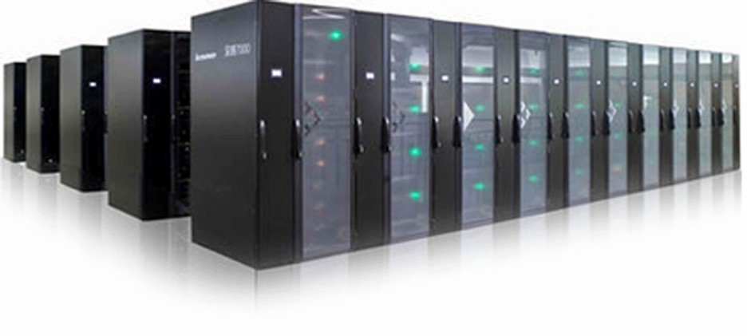


Chapter 1. Overview
===================

Introduction to Antilles
------------------------

Antilles is an infrastructure management software for high-performance computing (HPC). It provides features like cluster management and monitoring, job scheduling and management, cluster user management, account management, and file system management.

With Antilles, administrators can manage and monitor user groups, users, and billing groups within a cluster in a centralized manner. They can also schedule and monitor jobs, alerts, and reports, and perform various settings.

Features of Antilles
--------------------

- **Cluster resource monitoring:** Antilles provides a dashboard to monitor the usage of cluster resources, including CPU, memory, storage, and network.
- **Job template store:** Antilles provides multiple job templates, including HPC job templates, which help users submit jobs from Web pages with convenience.
- **Customized templates:** Users can create their own job templates to support other HPC applications.
- **Job management and monitoring:** Users can directly view and manage the status and results of jobs. Various common schedulers and a wide range of job types are supported.
- **User management and billing:** Antilles manages both local and domain users through the same interface. It supports user top-ups and chargebacks, and offers the ability to set billing groups and fees.
- **Customizations:** A range of customizations are available, such as enterprise job template customization, report customization, and 3D server visualization.
- **Expert Mode:** Antilles provides command line tools to submit and manage jobs. Expert users can log in to the login node via another shell and execute commands.

Terminology
-----------

- **Computer cluster:** a general reference to a collection of server resources including management nodes, login nodes, and computing nodes.
- **Job:** a series of commands in sequence intended to accomplish a particular task.
- **Job status:** the status of a job in the scheduling system, such as waiting, in queue, on hold, running, suspended, or completed.
- **Node status:** the status of a node, such as idle, busy, or off.
- **Job scheduling system:** the distributed program in control of receiving, distributing, executing and registering jobs, also referred to as the operation scheduler or simply scheduler.
- **Management node:** the server in a cluster running management programs such as job scheduling, cluster management and user billing.
- **Login node:** the server in a cluster to which users can log in via Linux and conduct operations.
- **Computing node:** the server in a cluster for executing jobs.
- **User group:** a set of users for which the system has defined an access control policy, so that all users in the same user group have access to the same set of cluster resources.
- **Billing group:** a group of cluster users that are to be billed under one account, also referred to as a billing account. A billing account can be made up of a single user or multiple users.

Prerequisite
------------

Antilles currently supports Slurm as the scheduler. The commands for Slurm in this Guide are not applicable to other schedulers.

Operating environment
---------------------

### Cluster server:

  Lenovo ThinkSystem servers

### Operating system

- CentOS / Red Hat Enterprise Linux (RHEL) 7.5
- SUSE Linux Enterprise server (SLES) 12 SP3

### Client requirements:

- **Hardware:** CPU of 2.0 GHz or above, memory of 8 GB or above
- **Browser:** Chrome (V 62.0 or higher) or Firefox (V 56.0 or higher) recommended
- **Display resolution:** 1280 x 800 or above

Chapter 2. Administrator home page
==================================

A user can assume three kinds of roles: administrator, operator, and ordinary user. Administrators can view the entire computer cluster and the information of all users. Operators can only view resources to which they have access, as well as their own information. Ordinary users can execute jobs and run operations such as job monitoring.

With the correct administrator username and password you can open the administrator home page.

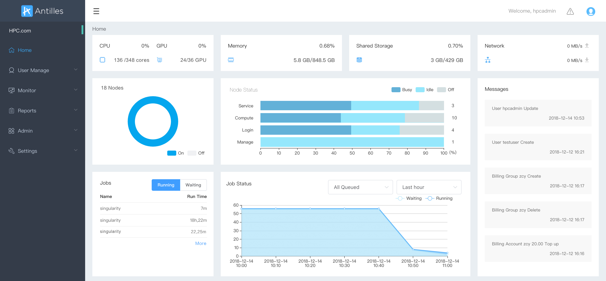

The left-hand side navigation bar shows the following elements:

- **HPC.com**: Cluster name. When the mouse hovers over it, the current scheduling and file service state is shown. You can refer to the Antilles Installation Guide to edit the cluster name.
- **Home**: the current page that shows basic cluster information.
- **User Management**: allows the administrator to perform basic operations on users, user groups, and billing groups.
- **Monitor**: provides functions for monitoring the HPC cluster.
- **Reports**: allows the administrator to export reports in Excel, PDF, or HTML format based on the job, alert, or action type
- **Admin**: allows the administrator to check the VNC, operation logs, and Web logs
- **Settings**: allows the administrator to perform actions on the queues, configure alerts for the HPC cluster, and manage notification groups and notification settings

The upper-right corner shows the following icons:

-  : shows the number of unconfirmed alerts in the current cluster. You can click this icon to enter the alert details page or to turn alert sounds on or off.
-  : You can click this icon to check current user information, edit current user password, log out, or switch between user roles.

Log in to the administrator home page
-------------------------------------

**Step 1.** Open a browser.

**Step 2.** Enter the IP address for the cluster's login node, such as https://10.220.112.21.

**Step 3.** Enter the correct administrator username and password.

**Step 4.** Click **Log in**.

The administrator home page is displayed.

Switch roles
------------

With the highest permission level in the system, an administrator can switch to the role of an operator or user and be redirected to the corresponding home page.

**Step 1.** 

Click  in the upper-right corner.
A list is displayed for you to choose the role to switch to.

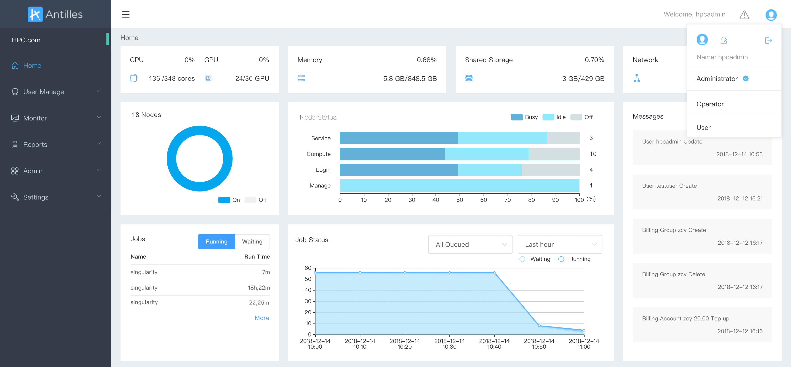

**Step 2.** 

Click the role you want to switch to.
Click **Operator** to switch to the operator role.
Click **User** to switch to the user role.

The operator home page or user home page is displayed.

Change the account password
---------------------------

**Step 1.**

Place your cursor over  in the upper-right corner of the administrator home page.
The user information dialog is displayed.

**Step 2.**

Click  The Change password dialog is displayed.

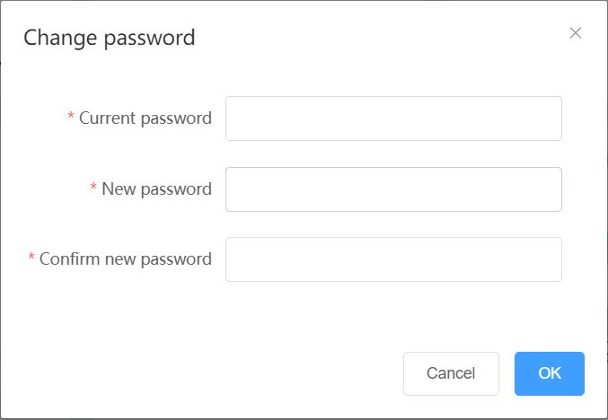

**Step 3.** Enter the current password, and then enter the new password twice.

**Step 4.** Click **OK**.

Your password is changed.


Cluster status view
-------------------

The administrator home page shows the basic status of the entire cluster. You can click  to maximize or minimize the navigation bar.


The cluster overview page consists of the following elements:

<table>
    <tr>
        <th width="20%">Element</th>
        <th>Description</th>
    </tr>
    <tr>
        <td>CPU</td>
        <td>utilization rate of the CPUs in a server cluster, indicated by the percentage of CPU cores in use among the total CPU cores in a cluster</td>
    </tr>
    <tr>
        <td>GPU</td>
        <td>utilization rate of the GPUs in a server cluster, indicated by the percentage of GPU cores in use among the total GPU cores in a cluster</td>
    </tr>
    <tr>
        <td>Memory</td>
        <td>utilization of memory in the cluster, together with the amount of memory used and the total size of the memory in the cluster</td>
    </tr>
    <tr>
        <td>Shared Storage</td>
        <td>utilization of storage in the cluster, together with the storage used and the total storage in the cluster</td>
    </tr>
    <tr>
        <td>Network</td>
        <td>capacity of the network on a server cluster, including reading and writing speeds</td>
    </tr>
    <tr>
        <td>Nodes</td>
        <td>number of computers turned on or off in the computer cluster</td>
    </tr>
    <tr>
        <td>Node Status</td>
        <td>usage status of nodes on the computer cluster, including busy, idle, and off. The primary basis for determining node usage is that there is one or more jobs running on that node</td>
    </tr>
    <tr>
        <td>Jobs</td>
        <td>names and running times of jobs that are running or waiting.</td>
    </tr>
    <tr>
        <td>Job Status</td>
        <td>past information about the job, including the numbers of jobs running, waiting, and finished. An administrator can choose to display the number of jobs in all queues or the number of jobs in a certain queue. In terms of time, available display options include the last hour, the last day, the last seven days, and the last thirty days. In terms of job type, available display options include unfinished and finished jobs.</td>
    </tr>
    <tr>
        <td>Messages</td>
        <td>show the most recent operations log for the web system. When you place the cursor over the cluster name in the left navigation bar, the current scheduling and file service status is displayed.</td>
    </tr>
</table>

The health of the scheduler and parallel system is indicated by the following color-coded system:

**Scheduler**: Green means that the scheduler is working normally; red means that the scheduler is not working normally.

**Parallel File System**: Green means that the parallel file system is working normally; red means that the parallel file system is not working normally.

Cluster alert messages
----------------------

If alerts are triggered, the  symbol in the upper-right corner of the home page produces a red numerical prompt, showing the current number of unconfirmed alerts.

To view all alert information, place the cursor over , and then click **View All** in the displayed information box. To access this alert information page, you can also select **Monitor** ➙ **Alerts** from the left-hand side navigation bar.

In the information box, you can also choose to turn on or turn of the sound. When alert sound is turned on, every new alert triggers a sound.

Chapter 3. User management
==========================

There are three user constructs: user group, user, and billing group (or billing account), as explained in the table below.

<table>
    <tr>
        <th width="15%">User Construct</th>
        <th width="45%">Description</th>
        <th>Attributes</th>
    </tr>
    <tr>
        <td>User group</td>
        <td>A group of users on the HPC cluster with similar queue access permissions.</td>
        <td>-</td>
    </tr>
    <tr>
        <td>User</td>
        <td>List of users in the HPC cluster.</td>
        <td>Username, role, first name, last name, billing group, user group, last login time, e-mail, password</td>
    </tr>
    <tr>
        <td>Billing group</td>
        <td>The billing account number, which can be used by one or multiple users. When members of a billing group run applications in a cluster, the balance in the billing account will be debited according to the number of CPU cores used and the time taken in running the applications.</td>
        <td>Name, billing rate, used time, spent amount, balance, description</td>
    </tr>
</table>

User groups (using LDAP)
------------------------

Select **User Management** ➙ **User Groups** from the left navigation bar to enter the user group management page.

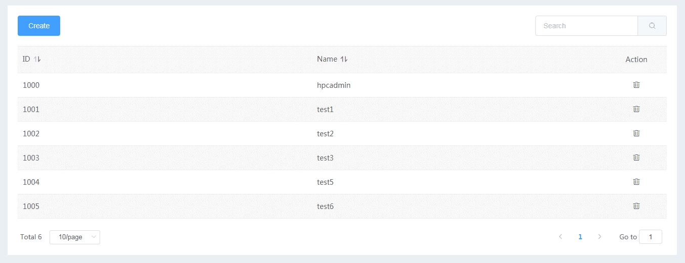

Create a user group
-------------------

During system initialization, a user group (with the default name default_os_group) is automatically created. However, it is recommended that the administrator create a new user group.

**Step 1.** 

On the user group management page, click **Create**.
The Create user group dialog is displayed.

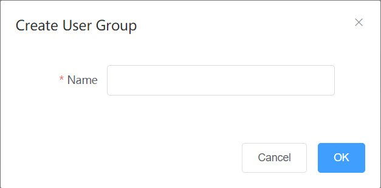

**Step 2.** Enter a unique name for the user group.

**Step 3.** Click **OK**.

A new user group is created.

Delete a user group
-------------------

Administrators can delete existing user groups.

**Step 1.**

On the user group management page, find the user group you want to delete, and then click  on the same row.
A dialog is displayed, asking you to confirm the deletion.

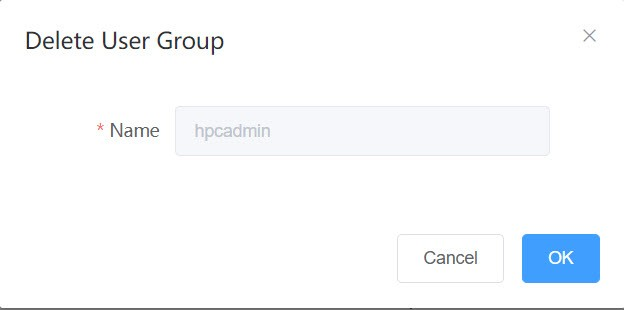

**Step 2.** Click **OK**.

The user group is deleted from the system.

User groups (not using LDAP)
----------------------------

Select **User Management** ➙ **User Groups** from the left navigation bar to enter the user group management page.

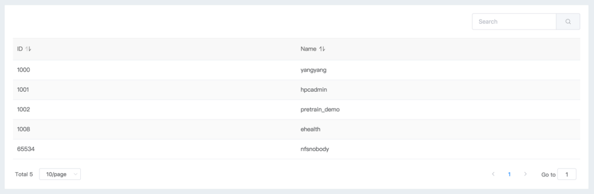

> **Note:** An administrator cannot create or delete a user group.

Users (using LDAP)
------------------

Select **User Management** ➙ **Users** from the left navigation bar to enter the user management page.

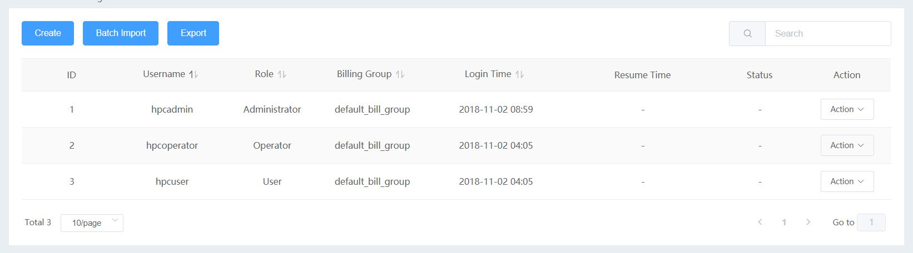

All actions in this section are performed on this page.

Create a user
-------------

During system initialization, an administrator account (with the default name “hpcadmin”) is automatically created.

**Step 1.**

On the user management page, click **Create**.
The Create User dialog is displayed.

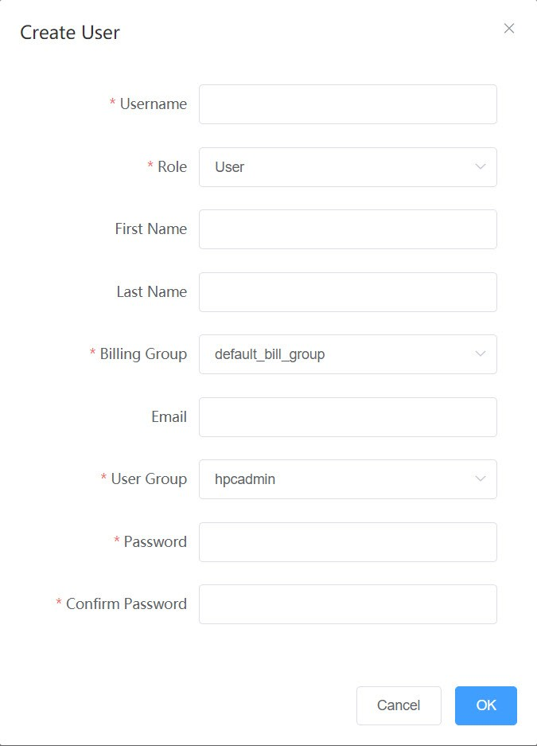

**Step 2.** Fill in the information in the dialog box.

  - **Username** must only contain lowercase letters, numbers, underscores, and minus signs. It must start with a letter.
  - **Password** should consist of at least 10 characters, including at least one uppercase letter, one lowercase letter, one special symbol, and one number.

**Step 3.** Click **OK**.

A user account is created and can be used for login.

Import users in batches
-----------------------

**Step 1.**

Click **Batch Import** on the user management page.
The User Batch Import dialog is displayed.

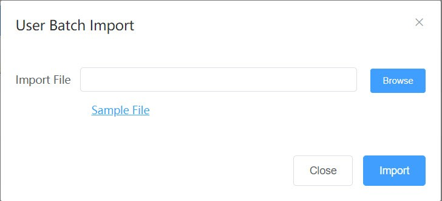

**Step 2.** 

Click **Browse**, and then select the file that contains the information about the users you want to import
You can click **Sample File** help yourself prepare the user information file.

**Step 3.** Click **Import**.

Users in the file are imported into the system.

When the user accounts are successfully imported, the users can log in.

Export a user
-------------

**Step 1.**

Select the user you want to export, and then click **Export**.
Your browser shows a dialog, asking your desired actions with the user information file in CSV format.

**Step 2.** Specify a location and save the CSV file.

Edit a user
-----------

An administrator can change user information such as the role, user group, billing group, and e-mail address.

**Step 1.**

Find the user you want to edit on the user management page, and then select **Action** ➙ **Edit**.
The Edit User dialog is displayed.


**Step 2.** Change the information in the dialog box.

**Step 3.** Click **OK**.

Change the user password
------------------------

An administrator can change passwords for operators or ordinary users, but not those of other administrators.

**Step 1.**

Find the user for which you want to change the password on the user management page, and then select **Action** ➙ **Change Password**.
The Change User Password dialog is displayed.

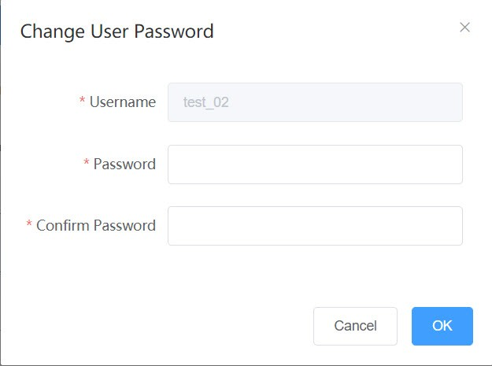

**Step 2.** Enter and confirm the new password.

**Step 3.** Click **OK**.

The user password is changed.

Delete a user
-------------

An administrator can delete existing users.

**Step 1.**

Find the user you want to delete, and then select **Action** ➙ **Delete**.
The Delete User dialog is displayed.

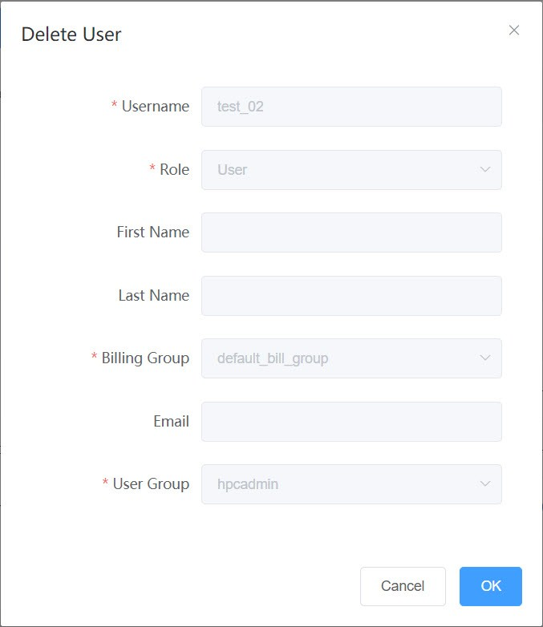

**Step 2.** Click **OK**. 

The user is deleted.

Suspend a user
--------------

An administrator can suspend the accounts of operators or ordinary users, but not those of other administrators.

**Step 1.**

Find the user account you want to suspend, and then select **Action** ➙ **Suspend**.
The Suspend User dialog is displayed.

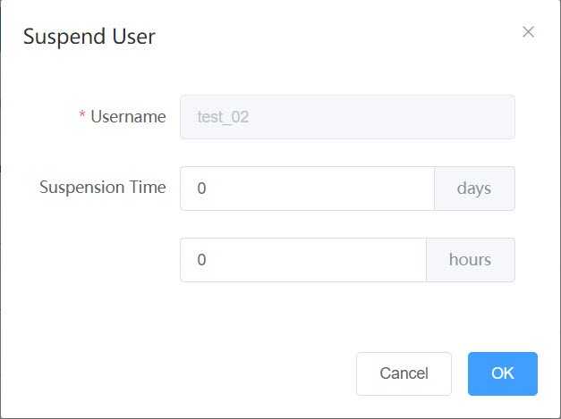

**Step 2.** Enter the suspension time as needed.

**Step 3.** Click **OK**.

The user account is suspended for the time you specified.

Resume a user
-------------

An administrator can resume suspended operators or ordinary users.

**Step 1.**

Find the suspended user you want to resume, and then select **Action** ➙ **Resume**.
The Resume User dialog is displayed.

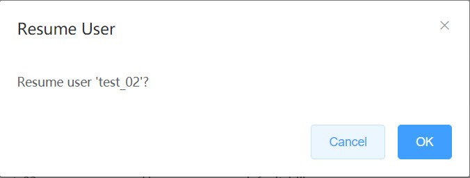

**Step 2.** Click **OK**.

The suspended user is resumed.

Browse user details
-------------------

Find the user whose details you want to browse, and then select **Action** ➙ **Info**. The user details page is displayed.

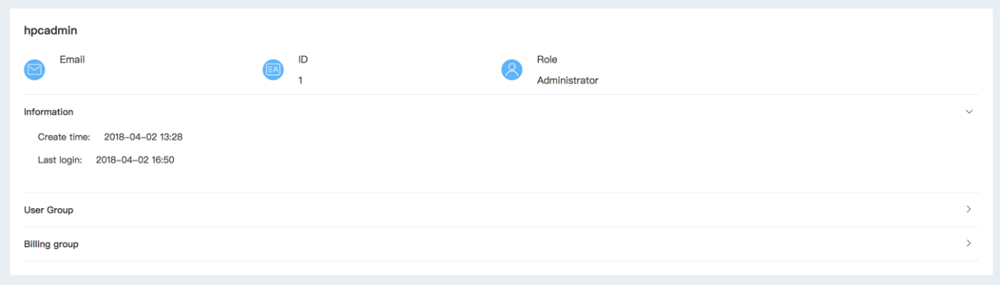

Users (not using LDAP)
----------------------

You can select **User Management** ➙ **Users** from the left navigation bar to enter the user management page.

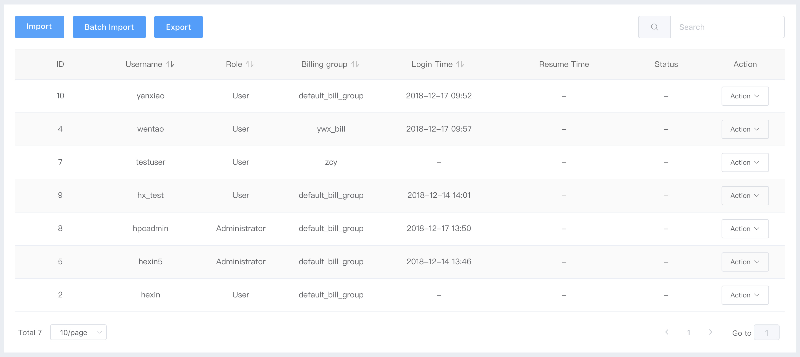

All actions in this section are performed on this page.

Import a user
-------------

**Step 1.**

Select **User Management** ➙ **Users** from the left navigation bar.
The Users page is displayed.

**Step 2.**

Click **Import**.
The Import User dialog is displayed.

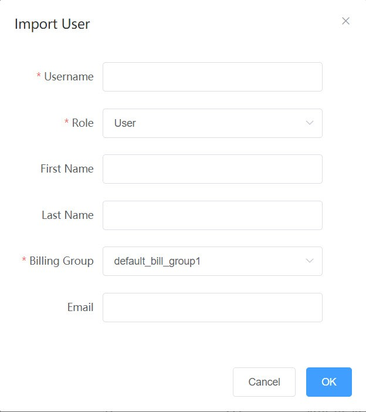

**Step 3.** Fill in the information as required.

**Step 4.** Click **OK**.

The system imports the user account.

When the user account is successfully imported, the user can log in.

Import users in batches
-----------------------

**Step 1.**

Click **Batch Import** on the user management page.
The User Batch Import dialog is displayed.

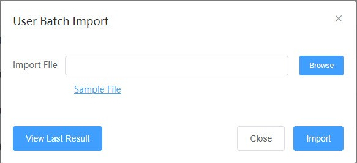

**Step 2.**

Click **Browse**, and then select the file that contains the information about the users you want to import
You can click **Sample File** help yourself prepare the user information file.

**Step 3.** Click **Import**.

Users in the file are imported into the system.

When the user accounts are successfully imported, the users can log in.

Export a user
-------------

**Step 1.**

Select the user you want to export, and then click **Export**.
Your browser shows a dialog, asking your desired actions with the user information file in CSV format.

**Step 2.** Specify a location and save the CSV file.

Edit a user
-----------

An administrator can change user information such as the role, user group, billing group, and e-mail address.

**Step 1.**

Find the user you want to edit on the user management page, and then select **Action** ➙ **Edit**.
The Edit User dialog is displayed.


**Step 2.** Change the information in the dialog box.

**Step 3.** Click **OK**.

Change the user password
------------------------

An administrator can change passwords for operators or ordinary users, but not those of other administrators.

**Step 1.**

Find the user for which you want to change the password on the user management page, and then select **Action** ➙ **Change Password**.
The Change User Password dialog is displayed.


**Step 2.** Enter and confirm the new password.

**Step 3.** Click **OK**.

The user password is changed.

Delete a user
-------------

An administrator can delete existing users.

**Step 1.**

Find the user you want to delete, and then select **Action** ➙
**Delete**.
The Delete User dialog is displayed.


**Step 2.** Click **OK**.

The user is deleted.

Suspend a user
--------------

An administrator can suspend the accounts of operators or ordinary users, but not those of other administrators.

**Step 1.**

Find the user account you want to suspend, and then select **Action** ➙ **Suspend**.
The Suspend User dialog is displayed.


**Step 2.** Enter the suspension time as needed.

**Step 3.** Click **OK**.

The user account is suspended for the time you specified.

Resume a user
-------------

An administrator can resume suspended operators or ordinary users.

**Step 1.**

Find the suspended user you want to resume, and then select **Action** ➙ **Resume**.
The Resume User dialog is displayed.


**Step 2.** Click **OK**.

The suspended user is resumed.

Browse user details
-------------------

Find the user whose details you want to browse, and then select **Action** ➙ **Info**. The user details page is displayed.


Billing groups
--------------

Antilles allows administrators to manage user billing groups in an easy and consolidated manner. You can create, edit, credit, debit, and delete billing groups.

During system initialization, a default billing group named "default_bill_group" is created. It is recommended that the administrator create a new billing group as needed.

Create a billing group
----------------------

**Step 1.**

Choose **User Management** ➙ **Billing Groups** from the left navigation bar.
The Billing Groups page is displayed.

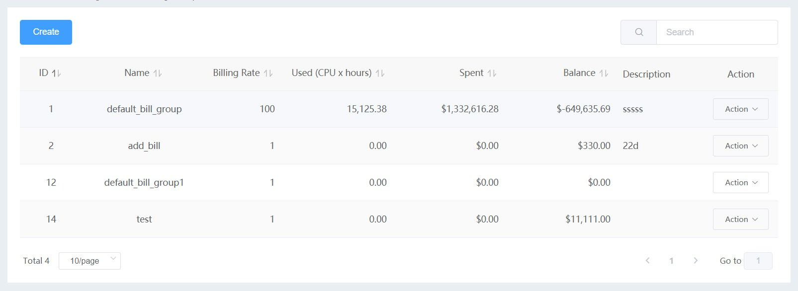

**Step 2.**

Click **Create** .
The Create Billing Group dialog is displayed.

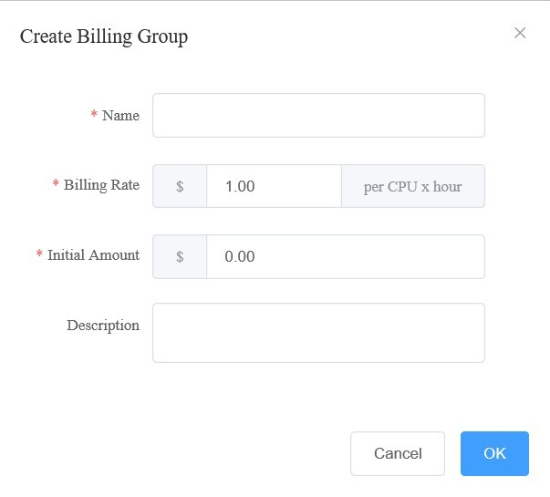

**Step 3.** Fill in the required information.

- **Name**: name of the billing group, which must be unique
- **Billing Rate**: The fee-per-unit computing time. If the rate is 1, any member of the billing group using 1 CPU core for 1 hour would be charged 1 US dollar.
- **Initial Amount**: the amount in the account when the billing group was created
- **Description**: a description of the billing group

**Step 4.** Click **OK**.

Edit a billing group
--------------------

**Step 1.**

Choose **User Management** ➙ **Billing Groups** from the left navigation bar.
The Billing Groups page is displayed.


**Step 2.**

Find the billing group you want to edit, and then select **Action** ➙ **Edit**.
The Edit Billing Group dialog is displayed.

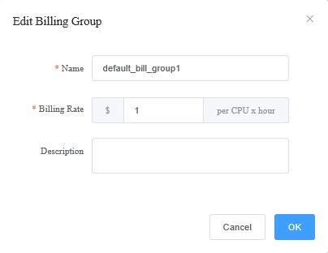

**Step 3.** Edit the parameters in this dialog as required.

**Step 4.** Click **OK**.

Deposit/Withdraw an account
---------------------------

**Step 1.**

Choose **User Management** ➙ **Billing Groups** from the left navigation bar.
The Billing Groups page is displayed.


**Step 2.**

Find the billing group you want to take account actions, and then select **Action** ➙ **Account Actions**.
The Billing Group Action dialog is displayed.

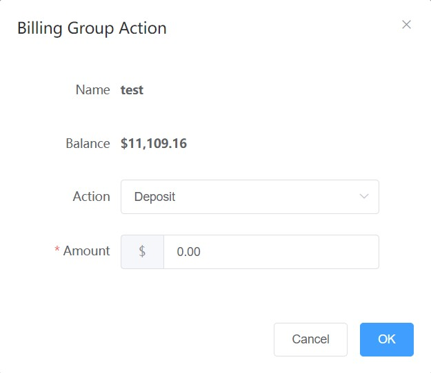

**Step 3.** Select the action from the **Action** drop-down list, and fill in the amount information.

**Step 4.** Click **OK**.

Delete a billing group
----------------------

**Step 1.**

Select **User Management** ➙ **Billing Groups** from the left navigation bar.
The Billing Groups page is displayed.


**Step 2.**

Find the billing group you want to delete, and then select **Action** ➙ **Delete**.
The Delete Billing Group dialog is displayed.

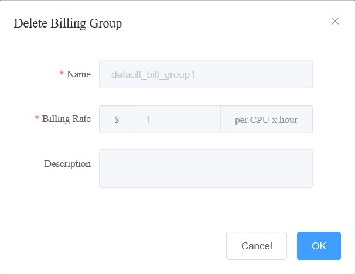

**Step 3.** Click **OK**.

Solutions to some user action failures
--------------------------------------

In the following circumstances, some user actions may fail:

- Network problems exist on the server nodes of a cluster.
- User groups or user accounts with identical names have been created in the operating system on the server nodes of a cluster.
- There are inconsistencies in user group or user account information in the operating system on the server nodes of a cluster.
- Slurm is not running properly.

Based on the failures above, use the following solutions:

1. Make sure the network connection is good, and root accounts can be accessed without a password across all server nodes.
2. Delete all failed user groups, billing groups, and user accounts and re-create these accounts.
3. Contact Lenovo after-sales service for technical support.

Chapter 4. User monitoring
==========================

Select **Monitor** from the left navigation bar. The following sub-options are displayed:

- **List: View**: shows detailed information about all nodes in a cluster, and allows the user to perform corresponding actions on nodes in that cluster
- **Physical View**: shows detailed node information based on the physical locations of all machines in the cluster
- **Group View**: shows detailed information about group nodes based on the functions of all nodes in the cluster
- **GPU View**: shows the monitoring information about every GPU based on the functions of all group nodes in the cluster
- **Jobs**: shows the running status of jobs currently on the cluster
- **Alerts**: shows the details of triggered alerts and manages the status of these alerts
- **Operation**: shows the logs of all action changes

List view
---------

In the List View page, information for all nodes in a cluster is displayed in a list, as shown below:

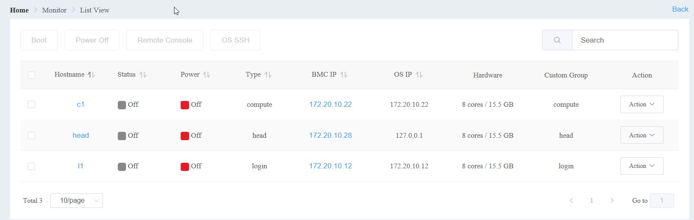

The parameters on the List View page are described as follows:

- **Host Name**: host name for the node
- **Status**: status of the node, which can be Idle, Busy, or Off
- **Power**: indicates whether the power is on or off
- **Type**: indicate the type of the node, which can be compute, head, login, I/O, and other user-defined nodes
- **BMC IP**: IP address of the head module BMC
- **OS IP**: IP address of the node
- **Hardware**: number of CPU cores on every node / the total memory on every node / the number of GPUs on every node (if there is no GPU, then the GPU section will not appear)
- **Custom Group**: the group to which the node currently belongs
- **Action**: The actions include Remote Console, OS SSH, Boot, Boot to Setup, Boot to Network, and Boot to Media.

Physical view
-------------

The Physical View page shows server room information, including room name and location, number of nodes, and total power consumption, and presents a graphic view of the number of racks and the locations of nodes, as shown below.

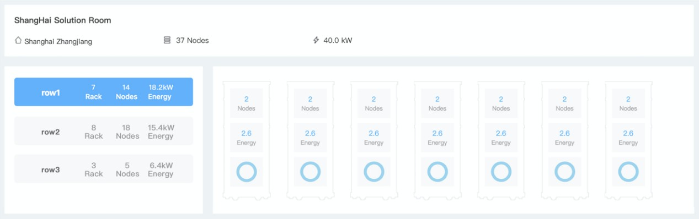

By clicking on a rack, the user can view detailed information about the rack, including:

- Rack name
- Rack location (related to the server room)
- Total number of nodes on a rack
- Total power consumption of a rack

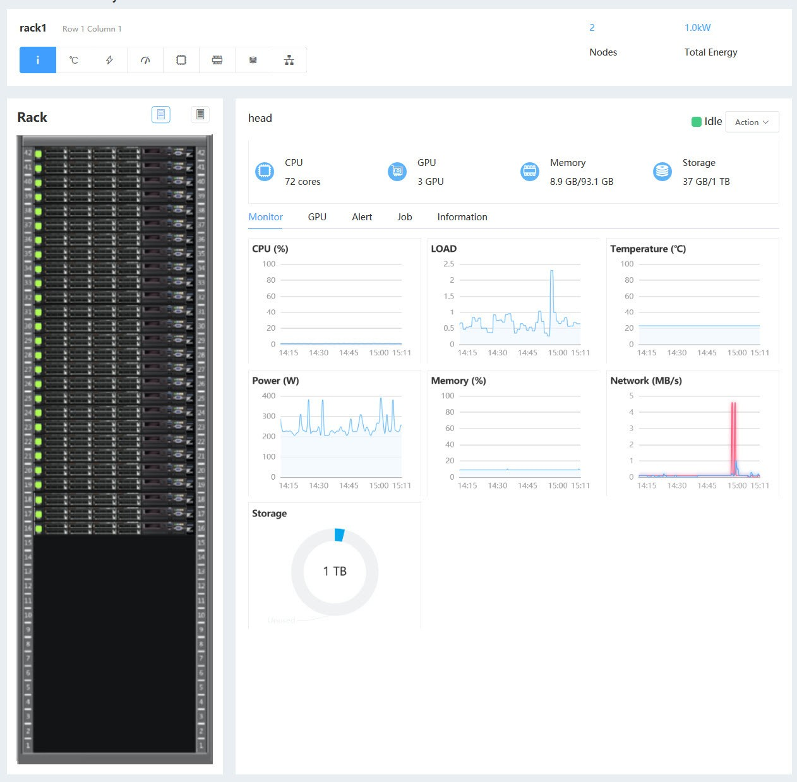

By clicking on a node in a rack, the user can view detailed information on the selected node.

By clicking on the icons above a rack, the user can switch between displays of temperature, power consumption, CPU/load, memory utilization ratios, hard drive utilization ratios, network throughput, and jobs.

Group view
----------

In the Group View page, the information about all nodes in a cluster is sorted by logical grouping. Click on the “Select Group” drop-down box in the top-left corner and select a group to be displayed, as shown below.

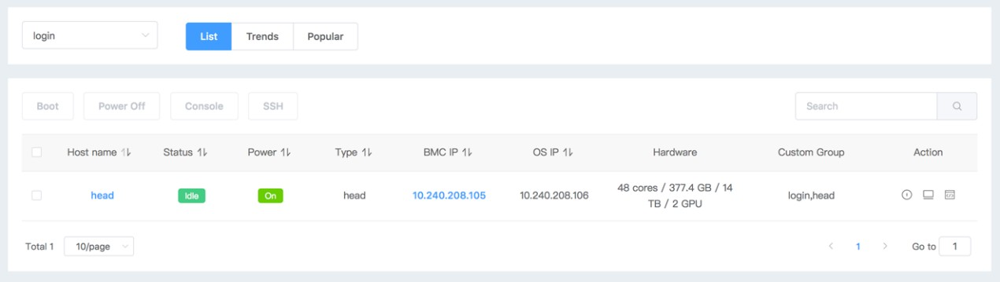

The Group View page offers the following monitoring types:

- **List**: a list of all nodes in this group, which has similar functionality as "List View"
- **Trends**: shows the trend diagram for the group, including load, CPU, memory, hard drive, network, energy consumption, temperature, and job use
- **Popular**: shows a heat diagram including load, CPU, memory, hard drive, network, energy consumption, temperature, and job use for all nodes in the group

GPU view
--------

The GPU View page shows GPU information about the nodes in a group based on the logical grouping of all nodes in a cluster. Click the group option in the upper-left corner of GPU View, as shown below.

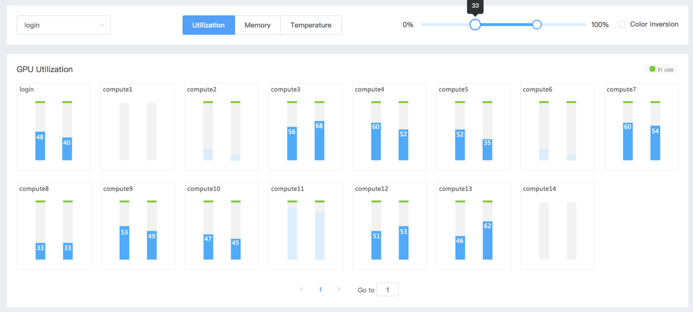

This interface presents real-time GPU data for the group in graphic form and allows the user to switch between GPU usage rates, memory, and temperature. Every frame in the image represents a node, with the name of the node written in the upper-right corner of the frame. A bar inside every frame represents a GPU, and the blue portion of the bar represents the monitored values. An orange section at the top of the bar means that the GPU is in use. Using the slide in the upper-right are, the user can adjust the colors of the columns to filter and highlight GPUs in a given numerical range. Select the Color Reversal box to the right of the slide to switch the colors that denote values inside and outside the stated range.

Jobs
----

The Jobs page shows job information and status, as well as jobs running in the current cluster, as shown below.

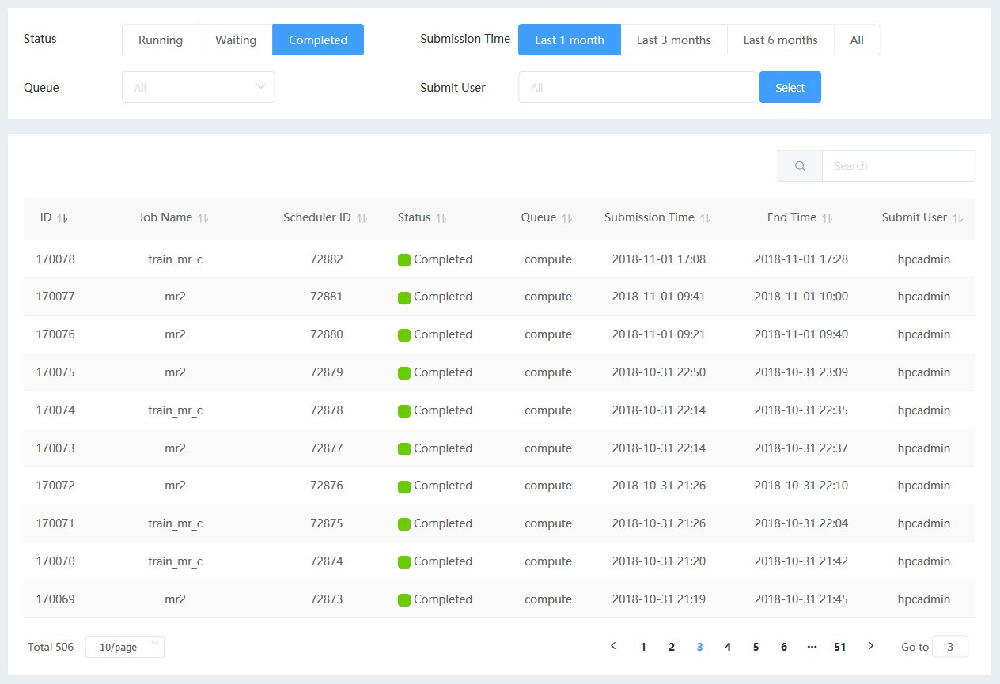

Jobs in the list can be filtered by the changing criteria at the top of the list, which include:

- **Queue**: You can filter the queues running in the system.
- **Submit User**: You can filter based on the user who submitted the job.
- **Status**: You can select Running, Waiting, or Complete.
- **Submission Time**: filters the jobs using their submission time. You can select Last 1 month, Last 3 months, Last 6 months, or All.

Alerts
------

The Alert page shows alert information for all triggered alert rules, as shown below.

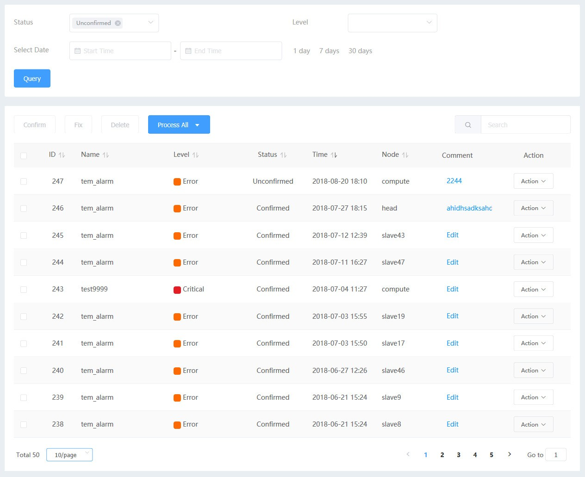

The displayed information includes:

- **ID**: the alert ID corresponding to the alert rule
- **Name**: the alert name corresponding to the alert rule
- **Level**: Critical, Serious, Alert, or Information
- **Status**: Unconfirmed, Confirmed, or Fixed
- **Time**: the time when the alert was triggered
- **Select Date**: Select the start time and end time to filter the alerts, or select 1 day, 7 days, or 30 days to view the alerts in the specified period back from the current time.
- **Node**: the monitored node corresponding to the alert rule. When a GPU alert takes place, the GPU serial number increases. For example, node1: gpu0.
- **Comment**: notes for the alert
- **Action**: Confirm, Fix, or Delete.

Alert events are classified into current events and all events. Current events include only unconfirmed events, whereas all events include confirmed events.

Alert event information includes:

- **Serial Number**: unique ID for the alert event
- **Alert Name**: name corresponding to the alert strategy
- **Alert Grade**: grade of the corresponding alert strategy
- **Status**: current status of the alert: Unconfirmed, Confirmed, or Fixed
- **Alert Time**: the time when the alert occurred
- **Alert Node**: name of the node on which the alert occurred
- **Notes**: the administrator's description of this alert

Alert information can be filtered by selecting criteria at the top of the page, and multiple choices can be made for status and grade. Alert information can be filtered by time, such as last day, last three days, last week, and last month, or by time criteria manually set with start and end dates.

The user can act on a selected node by clicking the appropriate button in the action list, or by selecting a node and then clicking "Confirm", "Resolve" or "Delete". The user can also select "Act on All" to perform the same action on all alert messages. Actions are defined as follows:

- **Confirm**: applicable to unconfirmed alerts. After confirmation, a reminder for the alert will not be shown in the upper right corner of the home page, and after action is taken, the status will be changed to "Confirmed"
- **Fix**: applicable to unconfirmed and confirmed alerts. After the administrator has handled the alert, this action can be taken and the status will be changed to "Fixed".
- **Delete**: applicable to unconfirmed, confirmed, and resolved alerts. After deletion, the alert will not be shown on the list.

Operation
---------

The Operation page records the actions by all users for all targets in the system, as shown below.

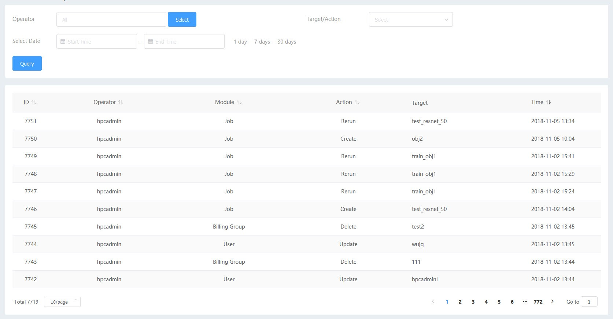

The operation monitoring page shows the following elements:

- **Operator**: operator account to which the action information belongs
- **Module**: the module of the action, such as user or job
- **Action**: specific commands for the action, such as creation or deletion
- **Target**: the target of the action, such as a user or node
- **Time**: the time when the target action occurred

Information will be displayed at the top of the page according to the filtering criteria. Operator information can be viewed by selecting "Operator" from the drop-down list. The "Target/Action" drop-down list allows for the user to filter action information by targets and actions. Alert information can be filtered by time, such as last day, last three days, last week, and last month, or by time criteria manually set with a start and end date.

The following target/action information is recorded in action monitoring:

- **User**: create, update, delete
- **Job**: create, re-run, cancel, delete
- **Node**: turn on, turn off
- **Alerts**: confirm, fix, delete, comment
- **Policy**: create, update, delete
- **Billing Group**: create, update, delete
- **Billing Account**: top up, deduct

Chapter 5. Reports
==================

Reports consist of the following types:

- **Job Reports**: statistics and details of jobs, users, and billing groups
- **Alert Reports**: statistics and details of alerts
- **Action Reports**: running status, connected users, user login status, and user storage statistics for the node

Job reports
-----------

The Job Reports page allows administrators to obtain reports on jobs.

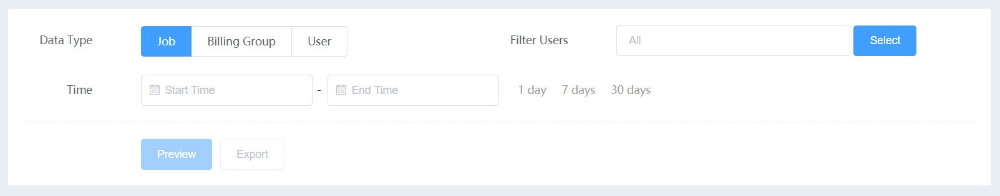

The report filters include:

- **Job Type**: filters by job, user, or billing group
- **Time**: supports pre-defined and self-defined time periods of no longer than one year
- **Filter User**: filters the selected users
- **Billing Group**: filters the selected billing group

The preview function includes:

- **Job Report Preview**: supports bar graphs and tables
- **User Report Preview**: supports pie charts, bar graphs, and tables
- **Details**: Pie charts and bar graphs are the default, but users can also show data in table form. Click on the right side of the pie chart to refresh current user/billing group job data.
- **Billing group Report Preview**: supports pie charts, bar graphs, and tables

The report exporting function includes:

- **Content**: supports the export of statistics and detailed data
- **Report format**: supports Excel, PDF, and HTML

Alert reports
-------------

The Alert Reports page allows administrators to obtain reports on alerts. It supports pre-defined and self- defined time periods of up to one year.

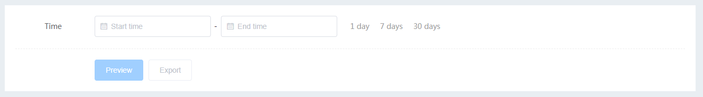

You can click **Preview** to directly preview alert data, which can be shown as a pie chart, bar graph, or table.

You can also click **Export** and set the filters in the displayed Export dialog to export alert reports, as shown below.

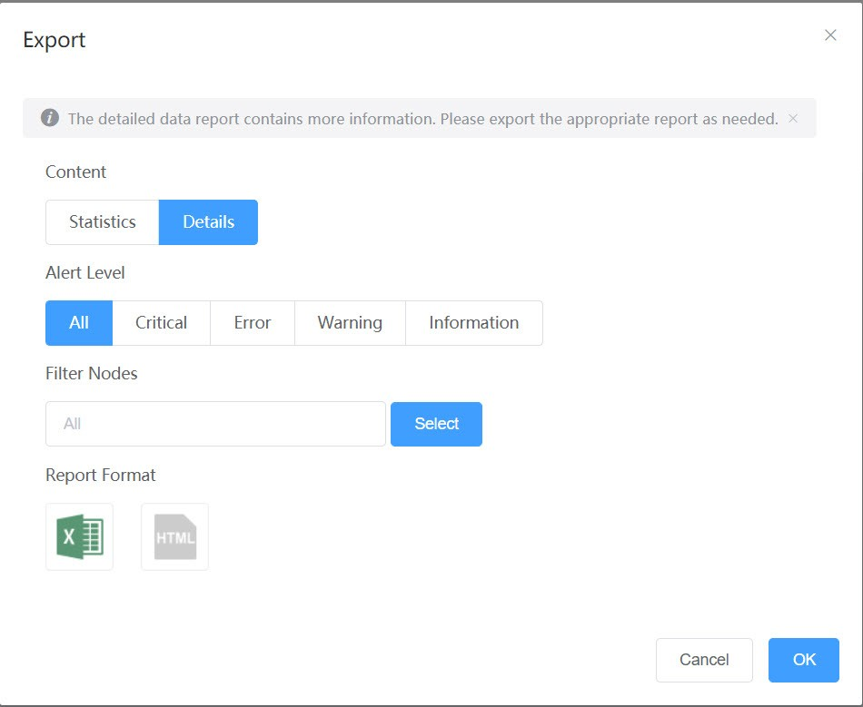

The parameters in the Export dialog are described as follows:

- **Content**: supports the export of statistics or detailed data
- **Alert level**: All, Critical, Error, Warning, or Information
- **Report Format**: supports Excel, PDF, and HTML

>   **Note:** After setting the filters and the report format, click**OK** to export the report.

Action reports
--------------

The Action Reports page allows administrators to obtain reports on actions, as shown below.

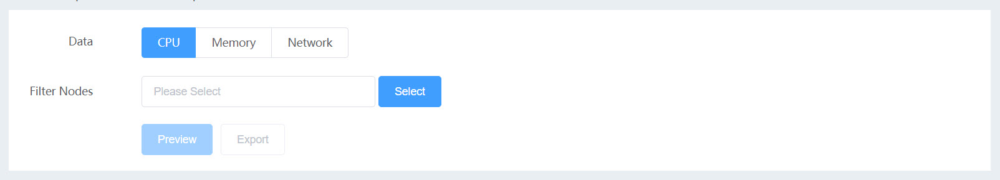

The report filters include:

- **Data**: Data on CPU, memory, and networks.
- **Filter Nodes**: Filter the selected nodes.

You can click **Preview** to preview filtered data in a graph.

You can also click **Export** and set the report format in the displayed Export dialog to export action reports, as shown below.

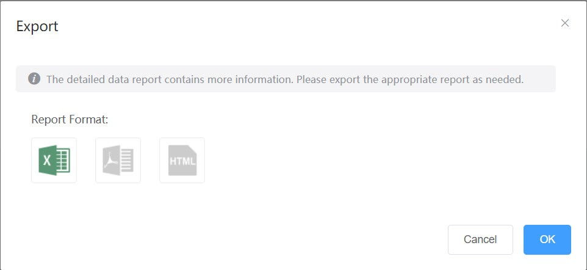

>   **Note:** After setting the report format, click**OK** to export the report.

Chapter 6. Admin
================

After the administrator logs in, they can click **Admin** on the left navigation bar to access **VNC**, **Operation Logs**, or **Web Logs**.

VNC
---

The VNC page shows VNC session information for compute nodes in the cluster and allows users to open the VNC.

The running of certain jobs requires VNC support. Before running the job, create a VNC session. Delete this VNC session when the job is finished.

The following is an example of a VNC job file:

```
cat Job.pbs

#!/bin/bash

#PBS -N short
#PBS -q batch
#PBS -j oe
#PBS -l nodes=2:ppn=4

cd /share/users_root/user1
echo current job id is $PBS_JOBID >> /share/users_root/user1/$PBS_JOBID.log
echo job start time is $(date) >> /share/users_root/user1/$PBS_JOBID.log
echo $(hostname) >> /share/users_root/user1/$PBS_JOBID.log
session=$(vncserver 2>&1)
sessionid=$(echo "$session"| grep "^New"| awk -F ":" '{print $3}')
echo "vncsession $sessionid is created" >> /share/users_root/user1/$PBS_JOBID.log
export DISPLAY=:$sessionid.0
./prog
vncserver -kill :$sessionid
echo job end time is $(date) >> /share/users_root/user1/$PBS_JOBID.log
```

Manage VNC sessions on the Web
------------------------------

The VNC page shows all VNC sessions in real time, including the creator, node, port number, process ID, and index of the VNC session.

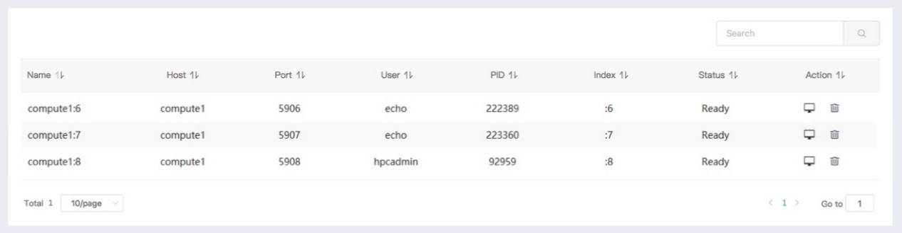

To view a VNC session, select a VNC session and click **Open** in the Actions column.

>   **Note:** If the VNC session is locked, only the session creator can view this session.
>   A user should only have one VNC session per node. However, too many VNC sessions may accumulate if VNC sessions are not deleted at the end of a job.
>   Testing has shown that a user may have more than 20 VNC sessions on one node, but the user may not be allowed to create a new VNC session, so unnecessary VNC sessions should be deleted.

To delete a VNC session, click **Delete** in the corresponding Actions row and then click **Confirm and Submit** in the dialog that pops up.

Manage VNC sessions using command lines
---------------------------------------

In a cluster node, the current user can create a session on the VNC server.

**Step 1.** Switch to a Antilles user through the command lines, and enter the directory `/home/antilles_1.0.0/cluster_monitor_project`.

**Step 2.** Start `antilles-vnc-slave` using the following command lines below on the node that runs the VNC server:

`service antilles-vnc-slave start`

**Step 3.** Change the IP address in `/opt/antilles/vnc-slave/etc/antilles-vnc-slave.ini` to the IP address of the cluster head node. Based on the circumstances, this step may be necessary because otherwise the page cannot obtain VNC information.

-   On a node within the cluster, the current user can only view VNC sessions he/she has created on VNC Server-List.
-   On a node within the cluster, the current user can only use VNC Server–Kill
    to delete VNC sessions they have created.
-   On a node within the cluster, view all VNC sessions on the node using the command `ps -ef\|grep Xvnc`, and then delete VNC sessions using the deletion process. Please use kill rather than kill-9 when deleting.
-   The result of an action performed with the above command lines may be shown on the Antilles page. The jobs deleted by the user via command lines will disappear from Antilles after about 30 seconds. Sessions the user has newly created via command lines will show on the Antilles page after about 30 seconds.

Operation logs
--------------

Log in as an administrator, and select **Admin** ➙ **Operation Logs** from the left-hand side navigation tree. The Operation Logs page is displayed, as shown below.


To download operation logs, set the time range and click **Download**.

Web logs
--------

Log in as an administrator, and select **Admin** ➙ **Web Logs** from the left-hand side navigation tree. The Web Logs page is displayed, as shown below.


Chapter 7. Settings
===================

The Settings menu allows the user to manage alert rules, alert notification groups, alert notification connections, and alert triggering scripts.

After logging in as an administrator, select **Settings** from the left navigation bar, and then select the desired sub-items.

Scheduler
---------

Select **Settings** ➙ **Scheduler** from the left navigation bar.

The Scheduler page is displayed, which allows administrators to create, edit, delete queues, set queue state, and set node state.

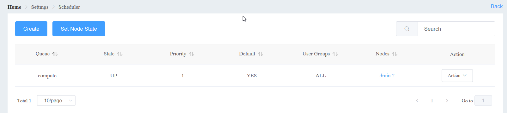

All actions in this section are performed on this page.

Create a queue
--------------

**Step 1.** Click **Create** on the Scheduler page. The Create Queue dialog is displayed.

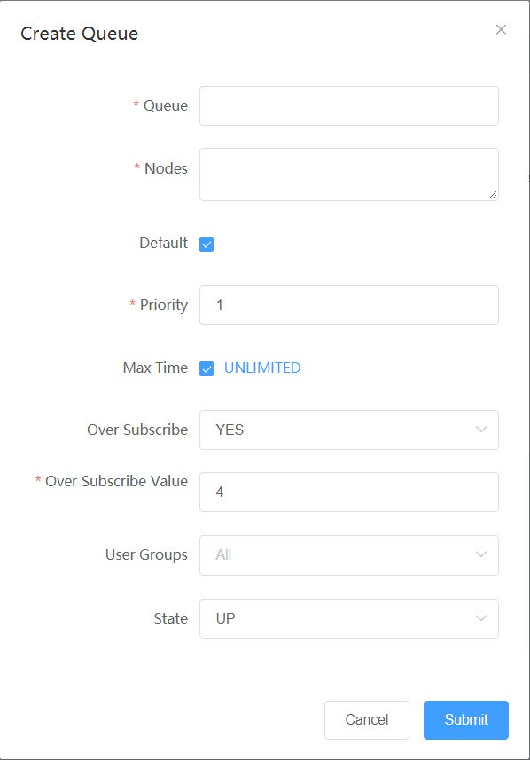

**Step 2.** Fill in the required information.

- **Queue**: self-defined queue name
- **Nodes**: identifies the node(s) to be associated with this queue. Multiple node names may be specified using simple node range expressions such as `lx[10-20]`. Note that a job can only be associated with one queue at any time.
- **Default**: indicates whether a queue is to be used by jobs that do not have specified queues
- **Priority**: Jobs submitted to a higher priority queue will be dispatched before pending jobs in lower priority queues and if possible they will preempt running jobs from lower priority queues. Note that a queue's priority takes precedence over a job's priority. The value cannot exceed 65533.
- **Max Time**: The maximum running time for jobs. If the box is selected, the time is "UNLIMITED". Otherwise, you need to input the time, the input format is `<days>-<hours>:<minutes>`. For example, `2-23:59`.
- **Over Subscribe**: specifies whether compute resources (individual CPUs) in this queue can be shared by multiple jobs. Possible values are `YES`, `NO`, `EXCLUSIVE` and `FORCE`. An optional job count specifies how many jobs can be allocated to use each resource.
- **State**: specifies whether jobs can be allocated nodes or queued in this queue. Possible values are `UP` and `DOWN`. The value can also be `DRAIN` or `INACTIVE` when you edit or set the queue state.

    - **UP**: indicates that new jobs can be added to the queue, and jobs can be allocated to nodes and run from the queue.
    - **DOWN**: indicates that new jobs can be added to the queue, but queued jobs cannot be allocated to nodes and run from the queue. Jobs already running on the queue continue to run. They must be explicitly cancelled to force their termination.
    - **DRAIN**: indicates that no new jobs can be added to the queue (job submission requests will be denied with an error message), but jobs already queued on the queue can be allocated to nodes and run.
    - **INACTIVE**: indicates that no new job can be added to the queue, and jobs that are already in the queue cannot be allocated to nodes or run.

**Step 3.** Click **Submit**.

Edit a queue
------------

**Step 1.** Find the queue you want to edit, and then select **Action** ➙ **Edit**.
The Edit Queue dialog is displayed.

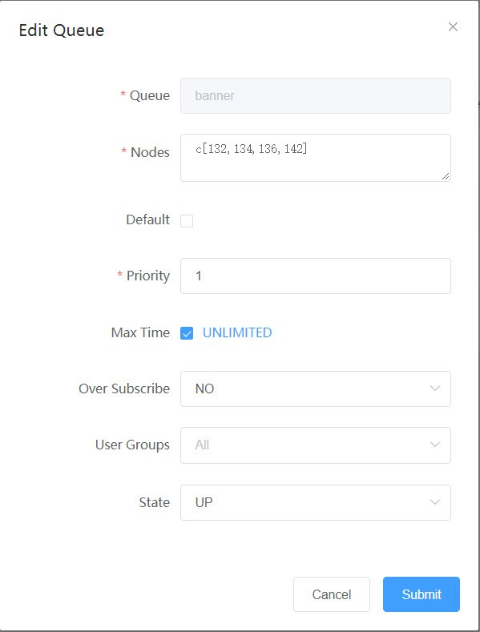

**Step 2.**

Edit the queue information as required.
For the parameter description, see "Create a queue".

**Step 3.** Click **Submit**.

Delete a queue
--------------

**Step 1.**

Find the queue you want to delete, and then select **Action** ➙ **Delete**.
The Delete Queue dialog is displayed.

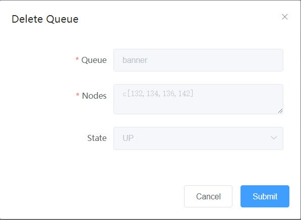

**Step 2.** Click **Submit**.

Set the state of a queue
------------------------

**Step 1.**

Find the queue whose state you want to change, and then select **Action** ➙ **Set Queue State**.
The Set Queue State dialog is displayed.

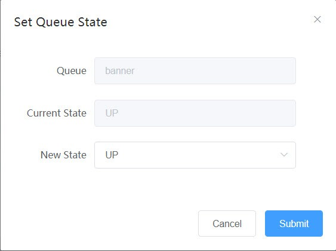

**Step 2.** Set the state of the queue.

**Step 3.** Click **Submit**.

Set the node state
------------------

**Step 1.**

Click **Set Node State** on the Scheduler page.
The Set Nodes State dialog is displayed.

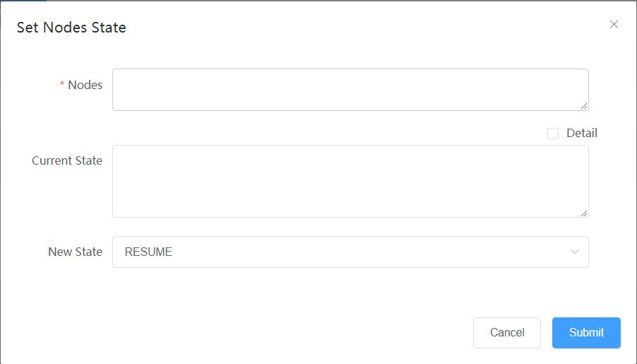

**Step 2.** Fill in the required information.

- **Nodes**: one node, multiple nodes, or a node expression
- **Current State**: indicates the current state of the node or nodes above
- **New State**: the state you want to set.

Alert policies
--------------

Select **Settings** ➙ **Alert Policy** from the left navigation bar.

The Alert Policy page allows administrators to view the alert policy for the current cluster, and add, update, or delete alert rules, as shown below.

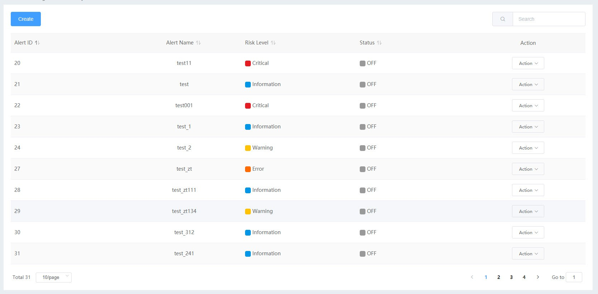

Create an alert policy
----------------------

**Step 1.**

Click **Create** in the upper-left corner of the page.
The Alert Policy dialog is displayed, as shown below.


**Step 2.** Fill in the alert rules.An alert policy must include the following information:

- **Alert name**: Self-defined alert name.
- **Monitor**: Antilles provides alert monitoring for the CPU usage rate, temperature, GPU usage rate, GPU temperature, network status, storage usage rate, energy consumption, and hardware problems.
- **Condition**: Set an alert trigger that is larger than, smaller than, or equal to a threshold value.
- **Duration**: For some monitored items, set the duration of the triggering condition. The default is 60 seconds.
- **Risk Level**: Self-defined risk level, including critical, serious, alert, and information.
- **Notification Group**: Notify one or more groups of users after an alert policy is triggered.
- **Monitoring Node**: Fill in the name of the node or nodes to be monitored. If left blank, the default is to monitor all nodes.
- **Configure Script**: Choose a script to run automatically after an alert is triggered.
- **Notice**: Turn on WeChat notifications and sound notifications.
- **Status**: Immediately start this alert strategy.

**Step 3.** Click **OK**.

Edit an alert policy
--------------------

**Step 1.**

Find the alert rule you want to edit, and then select **Action** ➙ **Edit**.
The Edit Policy dialog is displayed, as shown below.

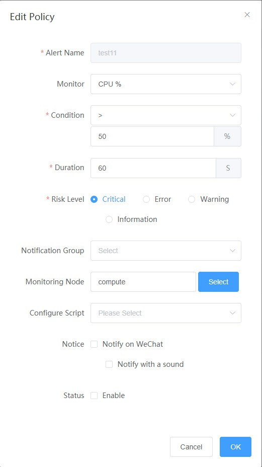

**Step 2.** Edit the alert rules in the dialog.

**Step 3.** Click **OK**.

Delete an alert policy
----------------------

**Step 1.**

Find the alert policy you want to delete, and then select **Action** ➙ **Delete**.
The Delete Policy dialog is displayed.

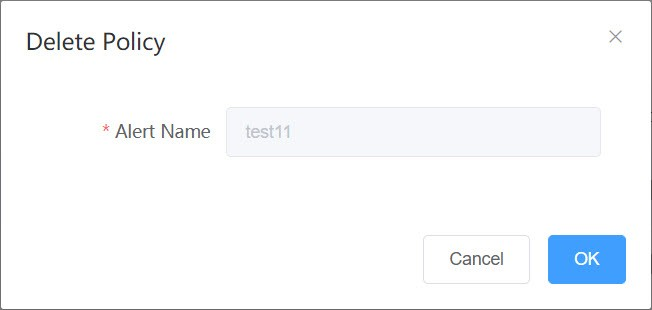

**Step 2.** Click **OK**.

Notification groups
-------------------

Notification groups are user groups that are notified when an alert is triggered. Select **Settings** ➙ **Scheduler** from the left navigation bar.

The Notification Group page, is displayed, which allows administrators to create, edit, and delete notification groups.

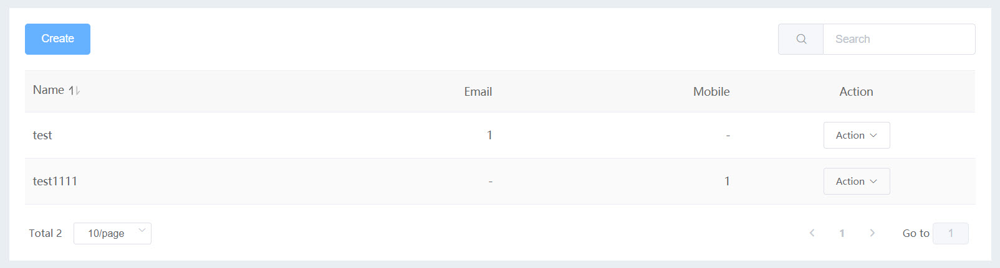

Create a notification group
---------------------------

**Step 1.**

In the upper-left corner of the Notification Group page, click **Create**.
The Create notification group dialog is displayed.

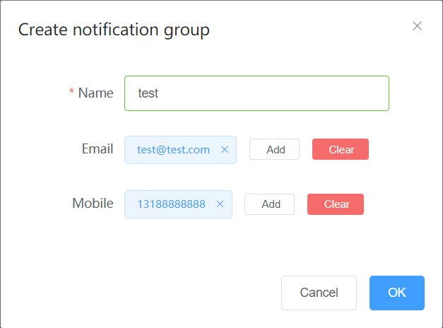

**Step 2.** Enter the group name, e-mail addresses, and mobile numbers for the notification group.

**Step 3.** Click **OK**.

The newly-created notification group is displayed in the list.

Edit a notification group
-------------------------

**Step 1.**

Find the notification group you want to edit, and then select **Action** ➙ **Edit**.
The Edit notification group dialog is displayed.

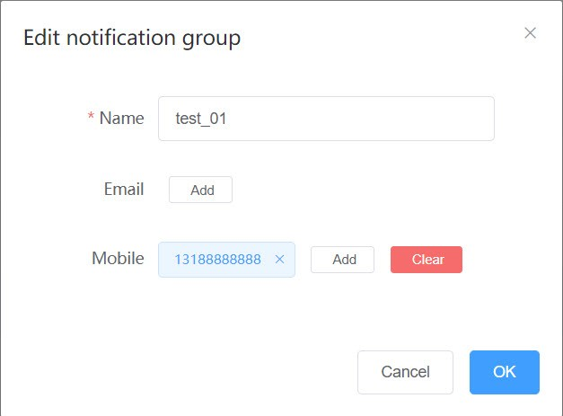

**Step 2.** Edit the notification group information.

**Step 3.** Click **OK**.

Delete a notification group
---------------------------

**Step 1.**

Find the notification group you want to delete, and then select **Action** ➙ **Delete**.
The Delete notification group dialog is displayed.


**Step 2.** Click **OK**.

The notification group is deleted.

Notification settings
---------------------

Select **Settings** ➙ **Notification Settings** from the left navigation bar.

The Notification Settings page is displayed, which allows administrators to manage the e-mail, SMS, and WeChat settings for the external alert API, as shown below.

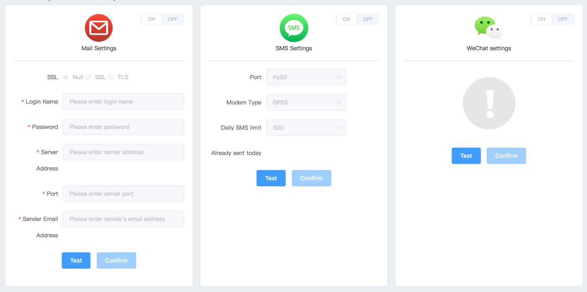

> **Notes:**
> - Turn the alert API on or off by clicking the **ON** or **OFF** buttons in the upper-right corner.
> - All changes to these settings will only be saved after you click **Confirm** at the bottom.
> - Test alert notification connections by clicking **Test** at the bottom of each area.

Scripts
-------

Select **Settings** ➙ **Scripts** from the left navigation bar.

The Scripts page is displayed, which allows administrators to manage scripts for creating alerts. The scripts displayed on the script management page have self-defined alert rules. The information displayed includes the script name, file size, and upload time, as shown below.

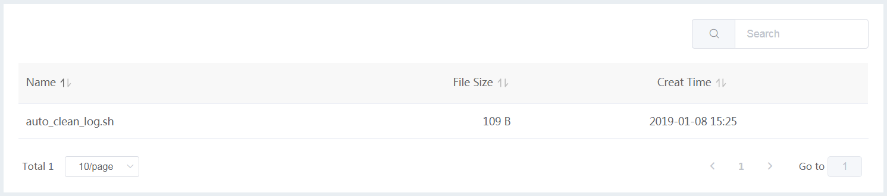

> **Notes:**
> - The scripts are located in the `/var/lib/Antilles/scripts` directory.
> - For security reasons, this page does not support uploading, updating, or deleting scripts. These actions should be performed using the background platform.

Chapter 8. HPC cluster management
=================================

Most HPC functions may be completed using the interface. However, because HPC cluster management is complicated, some more complex actions require command lines or other tools.

View HPC cluster details
------------------------

**Step 1.**

Select **Monitor** ➙ **List View** from the left-hand side navigation tree.
The List View page is displayed.


**Step 2.** View the HPC cluster information.The displayed information includes:

- **Hostname**: the cluster hostname
- **Status**: Idle, Busy, Off
- **Power**: On, Off
- **Type**: compute, management, login, I/O, and other user-defined nodes
- **BMC IP**: IP address of the management module XCC
- **OS IP**: IP address for the node
- **Hardware**: the number of CPU cores on every node/the total memory on every node /the total storage on every node/the number of GPUs on every node
- **Custom Group**: the group to which the node currently belongs

Remote management of HPC cluster software Interface management
--------------------------------------------------------------

On the List View page, click the "BMC IP" link in the node list to open a Lenovo XCC management module interface and perform remote hardware management, including a remote on/off switch, a remote console, and hardware configuration.

Enter the `username/password` (Factory Default: USERID/PASSW0RD) to log in to the XCC management interface.

>   **Note:** See the XCC User Manual for details: http://sysmgt.lenovofiles.com/help/index.jsp

Command line management
-----------------------

Select the required node, and click  or **Console** to open the control panel for the selected node.

Job scheduling commands
-----------------------

Antilles supports lifecycle actions such as uploading files, or submitting, cancelling, re-running, and deleting jobs. See the Antilles User Manual.

The administrator may use command lines to perform more complicated scheduling management jobs.

Queue commands
--------------

Queue management includes viewing, creating, and modifying queues. In queue management, the current user needs to log in to the head node and utilize Slurm scheduler command lines.

SSH Login for the Head Node:

-   View the queue: `[root@mgt /]# sinfo`

- Create a queue:

  1. Modify the Slurm configuration file `/etc/slurm/slurm.conf`, and add the following content:
    ```
    PartitionName=test Nodes=headnode, computenode1 Default=YES MaxTime=INFINITE State= UP
    ```

  1. Restart Slurm-related services:

    - On the management node: `[root@mgt /]# systemctl restart slurmctld`
    - On the compute node: `[root@mgt /]# systemctl restart slurmd`

After completing the steps above, the newly-created queue can be viewed on the interface.

The queue may be modified by changing the configuration file `/etc/slurm/slurm.conf`. The steps are the same as those for queue creation. View the queue parameters via `scontrol show partition`.

For more queue management commands, refer to http://slurm.schedmd.com/.

Job management
--------------

Job management can be performed on the Antilles interface. An administrator can view and act on a job by giving commands to the scheduler.

SSH Login to Head Node:

- View job status:

```
[root@mgt /]# squeue -a
JOBID PARTITION NAME USER ST TIME NODES NODELIST(REASON)
428 compute zhangtes testuser R 5:19 1 testcomputenode01
429 compute zhangtes testuser R 4:49 1 testcomputenode01
430 compute mnist-pa ls-test R 4:37 1 testcomputenode01
```

- View detailed job status: 
  `[root@mgt /]# scontrol show jobs`
- Use jobid to view the detailed status of a certain job:
  `[root@mgt /]# scontrol show jobs 428`
- Use jobid to cancel a job running or in the queue:
  `[root@mgt /]# scancel 428`

For more job management commands, refer to http://slurm.schedmd.com/.

>   **Note:** If a job is submitted through Slurm command lines, it will not start billing on the Antilles system.

Appendix A. Important information
=================================

Restart Antilles
----------------

If Antilles do not work normally, restart it.

- Stop Service:
  `[root@mgt antilles_1.0.0]# systemctl stop antilles`

- Start Service:
  `[root@mgt antilles_1.0.0]# systemctl start antilles`

- View Antilles Status:
  `[root@mgt antilles_1.0.0]# systemctl status antilles`

When Antilles starts normally, the screen shows like the following information:

```
[root@mgt qntilles_1.0.0]# systemctl status antilles
● antilles.service - antilles
   Loaded: loaded (/usr/lib/systemd/system/antilles.service; disabled; vendor preset: disabled)
   Active: active (running) since Mon 2018-12-10 14:37:45 CST; 6 days ago
 Main PID: 27583 (antilles)
    Tasks: 87
   Memory: 2.2G
```

Resolve a failed job submission
-------------------------------

The failure to submit a job on the Antilles interface may be caused by a poorly-configured Slurm scheduler. To check the cause of the failure, try the following suggestions:

- Use SSH to log in to the management node and re-submit the job using command lines: `cd` to the current user directory, find the job file, submit the job through `sbatch jobfile.slurm`, and then check to see which error message is returned. Resource limits may have been exceeded. For example, the job needs 100 cores, but there are only 80 in the cluster.
- Run the Slurm command `sinfo` on the head node and view the compute node status and resource status for the cluster.

If `sinfo` returns no results, no nodes have been added to the scheduling node. Open `/etc/slurm/slurm.conf` and add a compute node using the following format:

```
NodeName=nodename CPUs=cores State=node status
```

Following the addition, restarting the Slurm service at the head node may be required for the addition to take effect.

`[root@mgt Antilles_1.0.0]# sysemctl restart slurmctld`

If `sinfo` shows that some nodes are down, check whether Slurm services have been started on the down nodes.

`[root@mgt Antilles_1.0.0]# systemctl status slurmd`

Run Slurm command `scontrol show partition` on the management node to view the queue settings.

Manage user import using command lines
--------------------------------------

### Parameters for creating a user

Required parameters:

- **-u username**: requires the username
- **-r {user,operator,admin}**: specifies the user role

Optional parameters:

- **-b billgroup**: specifies the billing group for the user. This group name must already exist.

### Antilles user management actions

Antilles user management actions include the following:

- user_import
- user_export
- user_changerole
- user_resume

Batch deletion of jobs in the database
--------------------------------------

After Antilles has been running for a long period, jobs accumulate. Jobs can be deleted through the Manage interface, but if you want to delete jobs in batches, they can be deleted from the database directly. Antilles uses postgresql as a database. The database is on the management node and the database name is postgres.

The corresponding job table is webconsole_job. You can use a visualization tool, and use command lines similar to those below to delete unnecessary jobs from the database.

```
psql -h 127.0.0.1 -U postgres -d antilles

antilles=# select * from scheduler_job;
antilles=# delete from scheduler_job where id < 3;
antilles=# \q
```

Failure to view or delete a VNC
-------------------------------

You can restart Antilles if you fail to view a VNC session on the Antilles page.

If you fail to delete a VNC session on the Antilles page, log in to the VNC session node, view the process number of the VNC session to be deleted with the command ps -ef\|grep Xvnc, and delete the VNC session using the deletion process. Use kill rather than kill-9 when deleting a session. Information on the Antilles page will update after about 30 seconds.

Data sources for GPU monitoring
-------------------------------

Antilles can only monitor GPUs produced by NVIDIA. Monitoring data (including GPU usage rates, memory, temperature, and usage status) is obtained through the official NVIDIA API.

To check GPU monitoring data on the node's operating system, run `nvidia-smi` on the command line to check.
