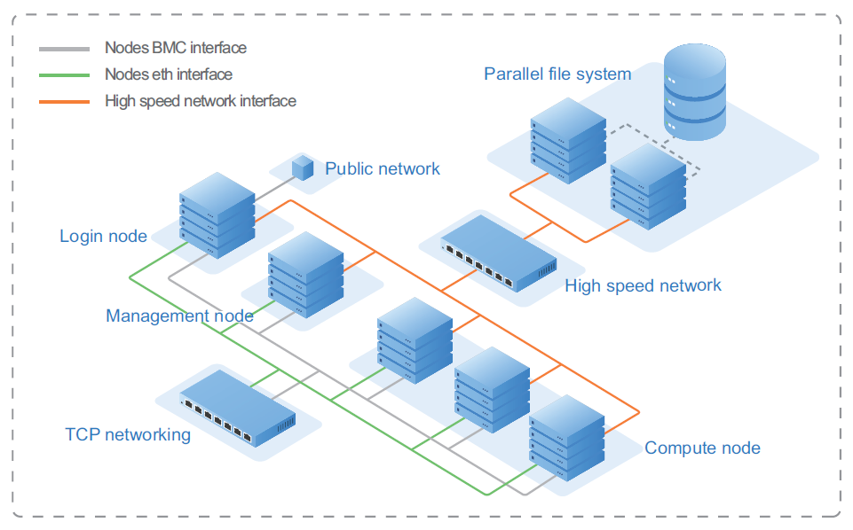
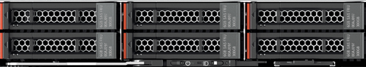
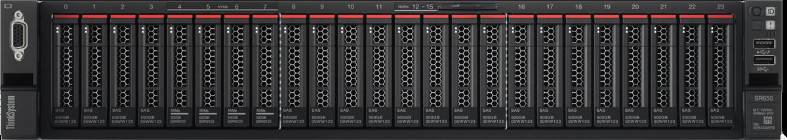
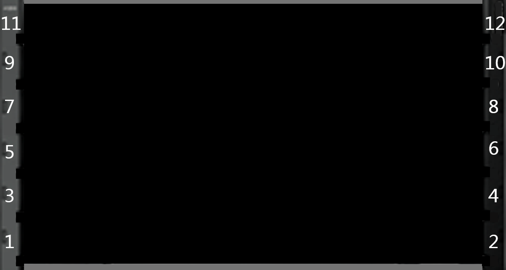

# Antilles Installation Guide (For EL7) 1.0.0 

- [1. Overview](#1)
    - [Introduction to Antilles](#1.1)
    - [Typical cluster deployment](#1.2)
    - [Operating environment](#1.3)
    - [Supported servers and chassis models](#1.4)
- [2. Prepare the cluster environment](#2)
    - [Prepare cluster OS and network enviroment](#2.1)
    - [Prepare infrastructure software for nodes](#2.2)
    - [Prepare Antilles Repo](#2.3)
    - [Prepare python modules Antilles requires](#2.4)
- [3. Install Antilles dependencies](#3)
    - [Check infrastructure environment](#3.1)
        - [Configure environment variables](#3.1.1)
        - [Precheck](#3.1.2)
    - [List of Antilles dependencies to be installed](#3.2)
    - [Install Antilles dependencies](#3.3)
        - [Install RabbitMQ](#3.3.1)
        - [Install PostgreSQL](#3.3.2)    
        - [Install InfluxDB](#3.3.3)
        - [Install Confluent](#3.3.4)
        - [Configure user authentication](#3.3.5)
            - [Install OpenLDAP-server](#3.3.5.1)
            - [Install libuser](#3.3.5.2)
            - [Install OpenLDAP-client](#3.3.5.3)
            - [Install nss-pam-ldapd](#3.3.5.4)
        - [Install Gmond GPU plugin](#3.3.6)
- [4. Install Antilles](#4)
    - [List of Antilles components to be installed](#4.1)
    - [Install Antilles on the management node](#4.2)
    - [Install Antilles on the login node](#4.3)
    - [Install Antilles on the compute node](#4.4)
- [5. Configure Antilles](#5)
    - [Configure the service account](#5.1)
    - [Configure cluster nodes](#5.2)
        - [Room information](#5.2.1)
        - [Logic group information](#5.2.2)
        - [Room row information](#5.2.3)
        - [Rack information](#5.2.4)
        - [Chassis information](#5.2.5)
        - [Node information](#5.2.6)
    - [Configure Antilles services](#5.3)
        - [Infrastructure configuration](#5.3.1)
        - [Database configuration](#5.3.2)
        - [Login configuration](#5.3.3)
        - [Storage configuration](#5.3.4)
        - [Scheduler configuration](#5.3.5)
        - [Alert configuration](#5.3.6)
        - [Confluent configuration](#5.3.7)
        - [User configuration](#5.3.8)
    - [Configure Antilles components](#5.4)
        - [antilles-vnc-mond](#5.4.1)
        - [antilles-portal](#5.4.2)
        - [antilles-ganglia-mond](#5.4.3)
        - [antilles-icinga-mond](#5.4.4)
        - [antilles-icinga-plugin](#5.4.5)
        - [antilles-confluent-proxy](#5.4.6)
        - [antilles-confluent-mond](#5.4.7)
    - [Initialize the system](#5.5)
    - [Initialize users](#5.6)
- [6. Start and log in to Antilles](#6)
    - [Start Antilles](#6.1)
    - [Log in to Antilles](#6.2)
- [Trouble Shooting](#99)
    - [Change a user's role](#99.1)
    - [Resume a user](#99.2)


<h2 id='1'> 1. Overview </h2>

<h3 id='1.1'>Introduction to Antilles</h3>

Antilles is an infrastructure management software for high-performance computing (HPC). It provides features like cluster management and monitoring, job scheduling and management, cluster user management, account management, and file system management.

With Antilles, users can centralize resource allocation in one supercomputing cluster and carry out HPC jobs. Users can perform operations by logging in to the management system interface with a browser, or by using command lines after logging in to a cluster login node with another Linux shell.

<h3 id='1.2'>Typical cluster deployment</h3>

This Guide is based on the typical cluster deployment that contains management, login, and compute nodes.



Elements in the cluster are described in the table below.

| Element | Description |
| ------- | ----------- |
| Management node | Core of the HPC cluster, undertaking primary functions such as cluster management, monitoring, scheduling, strategy management, and user & account management. |
| Compute node | Completes computing tasks. |
| Login node | Connects the cluster to the external network or cluster. Users must use the login node to log in and upload application data, develop compilers, and submit scheduled tasks. |
| Parallel file system | Provides a shared storage function. It is connected to the cluster nodes through a high- speed network. Parallel file system setup is beyond the scope of this Guide. A simple NFS setup is used instead. |
| Nodes BMC interface | Used to access the node’s BMC system. |
| Nodes eth interface | Used to manage nodes in cluster. It can also be used to transfer computing data. |
| High speed network interface | Optional. Used to support the parallel file system. It can also be used to transfer computing data. |

**Note:** Antilles also supports the cluster deployment that only contains the management and compute nodes. In this case, all Antilles modules installed on the login node need to be installed on the management node.

<h3 id='1.3'>Operating environment</h3>

**Cluster server:**

Lenovo ThinkSystem servers

**Operating system:**

CentOS / Red Hat Enterprise Linux (RHEL) 7.5

**Client requirements:**

- Hardware: CPU of 2.0 GHz or above, memory of 8 GB or above
- Browser: Chrome (V 62.0 or higher) or Firefox (V 56.0 or higher) recommended
- Display resolution: 1280 x 800 or above

<h3 id='1.4'>Supported servers and chassis models</h3>

Antilles can be installed on certain servers, as listed in the table below.

<table>
    <tr>
        <th>Product code</th>
        <th>Machine type</th>
        <th>Product name</th>
        <th>Appearance</th>
    </tr>
    <tr>
        <td>sd530</td>
        <td>7X21</td>
        <td>Lenovo ThinkSystem SD530 (0.5U)</td>
        <td></td>
    </tr>
    <tr>
        <td>sr630</td>
        <td>7X01, 7X02</td>
        <td>Lenovo ThinkSystem SR630 (1U)</td>
        <td></td>
    </tr>
    <tr>
        <td>sr650</td>
        <td>7X05, 7X06</td>
        <td>Lenovo ThinkSystem SR650 (2U)</td>
        <td></td>
    </tr>
    <tr>
        <td>sd650</td>
        <td>7X58</td>
        <td>Lenovo ThinkSystem SD650 (1U)</td>
        <td></td>
    </tr>
    <tr>
        <td>sr670</td>
        <td>7Y36, 7Y37, 7Y38</td>
        <td>Lenovo ThinkSystem SR670 (2U)</td>
        <td></td>
    </tr>
</table>


Antilles can be installed on certain chassis models, as listed in the table below.

<table>
    <tr>
        <th>Product code</th>
        <th>Machine type</th>
        <th>Model name</th>
        <th>Appearance</th>
    </tr>
    <tr>
        <td>d2</td>
        <td>7X20</td>
        <td>D2 Enclosure (2U)</td>
        <td></td>
    </tr>
    <tr>
        <td>n1200</td>
        <td>5456, 5468, 5469</td>
        <td>NeXtScale n1200 (6U)</td>
        <td></td>
    </tr>
</table>

<h2 id='2'> 2. Prepare the cluster environment </h2>

<h3 id='2.1'>Prepare cluster OS and network enviroment</h3>

Cluster OS and network should be ready.

<h3 id='2.2'>Prepare infrastructure software for nodes</h3>

Install the cluster infrastructure in accordance with the [OHPC](http://www.openhpc.community/) installation manual. Necessary software are listed in the table below.

<table>
    <tr>
        <th width="15%">Software name</th>
        <th width="20%">Component name</th>
        <th width="10%">Version</th>
        <th width="20%">Service name</th>
        <th>Notes</th>
    </tr>
    <tr>
        <td>nfs</td>
        <td>nfs-utils</td>
        <td>1.3.0</td>
        <td>nfs-server</td>
        <td></td>
    </tr>
    <tr>
        <td>ntp</td>
        <td>ntp</td>
        <td>4.2.6</td>
        <td>ntpd</td>
        <td></td>
    </tr>
    <tr>
        <td rowspan="2">slurm</td>
        <td>ohpc-slurm-server</td>
        <td>1.3.4</td>
        <td>munge, slurmctld</td>
        <td></td>
    </tr>
    <tr>
        <td>ohpc-slurm-client</td>
        <td>1.3.4</td>
        <td>munge, slurmd</td>
        <td></td>
    </tr>
    <tr>
        <td>ganglia</td>
        <td>ganglia-gmond-ohpc</td>
        <td>3.7.2</td>
        <td>gmond</td>
        <td></td>
    </tr>
    <tr>
        <td rowspan="3">mpi</td>
        <td>openmpi3-gnu7-ohpc</td>
        <td>3.0.0</td>
        <td></td>
        <td rowspan="3">At least one MPI type required. Make sure compute nodes can use command <code>mpirun</code> directly instead of specifying path to command <code>mpirun</code></td>
    </tr>
    <tr>
        <td>mpich-gnu7-ohpc</td>
        <td>3.2.1</td>
        <td></td>
    </tr>
    <tr>
        <td>mvapich2-gnu7-ohpc</td>
        <td>2.2</td>
        <td></td>
    </tr>
</table>

If GPU node(s) is included in the cluster, CUDA should also be installed on the GPU node(s). Recommended CUDA version is 9.1. Installation reference: https://developer.nvidia.com

<h3 id='2.3'>Prepare Antilles Repo</h3>

Packaging Antilles into RPMs and create repo for installing antilles modules.

Step 1. Download Antilles code from github.

Step 2. Run the following commands to packaging Antilles and create Antilles Repo:

```
cd /path/to/antilles
./packaging_antilles_el7.sh
```

**Note**: `/path/to/antilles` should be replaced by the real path where antilles code locate.

After create Antilles repo, distribute the antilles repo file to all nodes which would install antilles.

<h3 id="2.4">Prepare python modules Antilles requires</h3>

Before installing Antilles packages you should pre install python modules that Antilles packages require. Each of Antilles module has `requirements.txt`files, you should make sure all the python modules installed and the module's version is conforming to the requirements file.

<h2 id='3'>3. Install Antilles dependencies</h2>

<h3 id='3.1'>Check infrastructure environment</h3>

Make sure that the cluster environment is ready.

<h4 id='3.1.1'>Configure environment variables</h4>

Step 1. Log in to the management node.

Step 2. Run the following commands to configure environment variables for the entire installation process:
```
su root
cd ~
vi antilles_env.local
```

Step 3. Run the following commands to edit the `antilles_env.local` file:
```
# Management node hostname
sms_name="head"

# IP address of management node in the cluster intranet
sms_ip="192.168.0.1"

# Set the domain name
domain_name="hpc.com"

# Set OpenLDAP domain name
antilles_ldap_domain_name="dc=hpc,dc=com"

# set OpenLDAP domain component
antilles_ldap_domain_component="hpc"
```

Step 4. Save the changes to `antilles_env.local`.

Step 5. Run the following commands to make the configuration file take effect:
```
chmod 600 antilles_env.local
source antilles_env.local
```

<h4 id='3.1.2'>Precheck</h4>

Make sure services below already prepared.

| Infrastructure Software | Check Command | Notes |
| ------- | ------------- | ----- |
| nfs | `showmount -e ${sms_ip}` | |
| slurm | `sinfo` | |
| ganglia | `gstat -a` | |
| mpi | `module list` | |
| cuda| `nvidia-smi` | required by GPU node|
| OpenHPC | `yum repolist` | |

<h3 id='3.2'>List of Antilles dependencies to be installed</h3>

**Note:** In the Installation node column, M stands for "Management node", L stands for "Login node", and C stands for "Compute node".

<table>
    <tr>
        <th>Software name</th>
        <th>Component name</th>
        <th>Version</th>
        <th>Service name</th>
        <th>Installation node</th>
        <th>Notes</th>
    </tr>
    <tr>
        <td>rabbitmq</td>
        <td>rabbitmq-server</td>
        <td>3.6.15</td>
        <td>rabbitmq-server</td>
        <td>M</td>
        <td></td>
    </tr>
    <tr>
        <td>postgresql</td>
        <td>postgresql-server</td>
        <td>9.2.23</td>
        <td>postgresql</td>
        <td>M</td>
        <td></td>
    </tr>
    <tr>
        <td>influxdb</td>
        <td>influxdb</td>
        <td>1.5.4</td>
        <td>influxdb</td>
        <td>M</td>
        <td></td>
    </tr>
    <tr>
        <td>confluent</td>
        <td>confluent</td>
        <td>2.0.2</td>
        <td>confluent</td>
        <td>M</td>
        <td></td>
    </tr>
    <tr>
        <td rowspan="4">openldap</td>
        <td>slapd-ssl-config</td>
        <td>1.0.0</td>
        <td>slapd</td>
        <td>M</td>
        <td></td>
    </tr>
    <tr>
        <td>nss-pam-ldapd</td>
        <td>0.8.13</td>
        <td>nslcd</td>
        <td>M, C, L</td>
        <td></td>
    </tr>
    <tr>
        <td>libuser</td>
        <td>0.60</td>
        <td></td>
        <td>M</td>
        <td></td>
    </tr>
    <tr>
        <td>libuser-python</td>
        <td>0.60</td>
        <td></td>
        <td>M</td>
        <td></td>
    </tr>
    <tr>
        <td>gmond gpu plugin</td>
        <td>gmond-ohpc-gpu-module</td>
        <td>1.0.0</td>
        <td></td>
        <td>C</td>
        <td>Required only on the GPU node</td>
    </tr>
</table>

<h3 id='3.3'>Install Antilles dependencies</h3>

---

<h4 id='3.3.1'>Install RabbitMQ</h4>

Antilles uses RabbitMQ as a message broker.

Installation Reference: http://www.rabbitmq.com/

---

<h4 id='3.3.2'>Install PostgreSQL</h4>

Antilles uses PostgreSQL as an object-related database for data storage.

Installation Reference: https://www.postgresql.org/

After installation, run the following commands to configure PostgreSQL:

```
# Stop PostgreSQL on the management node
systemctl stop postgresql

# Initialization and passwords can be changed as needed.
su - postgres
echo <PG_PASSWORD> > /var/tmp/pwfile

# The value for the -U switch on the initdb command ("postgres") is the postgres username.
# Make sure to make note of this, as well as the other usernames and passwords used during this
# setup as they will be needed during the ico-passwd-tool step later in the installation process.
initdb -U postgres --pwfile /var/tmp/pwfile /var/lib/pgsql/data

rm /var/tmp/pwfile
exit

# Starting PostgreSQL
systemctl enable postgresql
systemctl start postgresql

# Create Antilles database
psql -U postgres -c "CREATE DATABASE antilles;"
```

---

<h4 id='3.3.3'>Install InfluxDB</h4>

Antilles uses InfluxDB as a time series database for storage monitoring.

Installation Reference: https://www.influxdata.com/

After installation, run the following commands to create InfluxDB users:
```
# Start InfluxDB
systemctl enable influxdb
systemctl start influxdb

# Enter the InfluxDB shell
# To create an administrator user, please note that the password must be a string, otherwise the error is reported.
influx
> create database antilles
> use antilles
> create user <INFLUX_USERNAME> with password '<INFLUX_PASSWORD>' with all privileges
> exit

# configuration
sed -i '/auth-enabled = false/a\ auth-enabled = true' /etc/influxdb/config.toml

# restart InfluxDB
systemctl restart influxdb
```

---

<h4 id='3.3.4'>Install Confluent</h4>

Installtion Reference: https://hpc.lenovo.com/yum/latest/

Run the following commands to configure Confluent:
```
# Start confluent
systemctl enable confluent
systemctl start confluent

# Create confluent count
source /etc/profile
confetty create /users/<CONFLUENT_USERNAME> password=<CONFLUENT_PASSWORD>
```


---

<h4 id='3.3.5'>Configure user authentication</h4>

**Note:** If you have already configured OpenLDAP for the cluster.

<h5 id='3.3.5.1'>Install OpenLDAP-server</h5>

OpenLDAP is an open-source version of the lightweight directory access protocol. Antilles recommends using OpenLDAP to manage users; however, it also supports other authentication services compatible with Linux-PAM.

Run the following commands to install OpenLDAP:
```
# Install OpenLDAP
yum install -y slapd-ssl-config

# Run the following commands to modify the configuration file
sed -i "s/dc=hpc,dc=com/${antilles_ldap_domain_name}/" /usr/share/openldap-servers/antilles.ldif
sed -i "/dc:/s/hpc/${antilles_ldap_domain_component}/" /usr/share/openldap-servers/antilles.ldif
sed -i "s/dc=hpc,dc=com/${antilles_ldap_domain_name}/" /etc/openldap/slapd.conf
slapadd -v -l /usr/share/openldap-servers/antilles.ldif -f /etc/openldap/slapd.conf -b ${antilles_ldap_domain_name}

# set password
# Get the key using the following command and enter <LDAP_PASSWORD> when prompted.
slappasswd

# Edit the file /etc/openldap/slapd.conf to cover the contents of the rootpw with the key obtained.
rootpw <ENCRYPT_LDAP_PASSWORD>
chown -R ldap:ldap /var/lib/ldap
chown ldap:ldap /etc/openldap/slapd.conf

# Edit configuration files
vi /etc/sysconfig/slapd
# Please make sure the next two lines are uncommented
SLAPD_URLS="ldapi:/// ldap:/// ldaps:///"
SLAPD_OPTIONS="-f /etc/openldap/slapd.conf"

# Start OpenLDAP service
systemctl enable slapd
systemctl start slapd

# check service
systemctl status slapd
```

<h5 id='3.3.5.2'>Install libuser</h5>

The libuser module is a recommended toolkit for OpenLDAP. The installation of this module is optional.

Step 1. Run the following command to install libuser:

```
yum install -y libuser libuser-python
```

Step 2. Run the following commands to configure libuser:

```
vi /etc/libuser.conf

[import]
login_defs = /etc/login.defs
default_useradd = /etc/default/useradd
[defaults]
crypt_style = sha512
modules = ldap
create_modules = ldap
[userdefaults]
LU_USERNAME = %n
LU_GIDNUMBER = %u
LU_GECOS = %n
# Pay attention to modify option below
LU_HOMEDIRECTORY = /home/%n
LU_SHADOWNAME = %n
LU_SHADOWMIN = 0
LU_SHADOWMAX = 99999
[groupdefaults]
LU_GROUPNAME = %n
[files]
[shadow]
[ldap]
# Modify <LDAP_ADDRESS> to management node IP
server = ldap://<LDAP_ADDRESS>
# Pay attention to modify option below
# Make sure <DOMAIN> should be the same with ${antilles_ldap_domain_name} defined in antilles_env.local
basedn = <DOMAIN>
userBranch = ou=People
groupBranch = ou=Group
binddn = uid=admin,<DOMAIN>
bindtype = simple
[sasl]
```

<h5 id='3.3.5.3'>Install OpenLDAP-client</h5>

Run the following commands to install OpenLDAP-client:
```
echo "TLS_REQCERT never" >> /etc/openldap/ldap.conf
```

Then distribute `/etc/openldap/ldap.conf` to all other nodes.

<h5 id='3.3.5.4'>Install nss-pam-ldapd</h5>

nss-pam-ldapd is a name service switching module and pluggable authentication module. Antilles uses this module for user authentication.

Run the following commands to install nss-pam-ldapd **on all nodes**:
```
yum install -y nss-pam-ldapd authconfig
authconfig --useshadow --usemd5 --enablemkhomedir --disablecache --enablelocauthorize --disablesssd --disablesssdauth --enableforcelegacy --enableldap --enableldapauth --disableldaptls --ldapbasedn=${antilles_ldap_domain_name} --ldapserver="ldap://${sms_name}" --updateall
echo "rootpwmoddn uid=admin,${antilles_ldap_domain_name}" >> /etc/nslcd.conf

# Start management node service
systemctl enable nslcd
systemctl start nslcd
```

---

<h4 id="3.3.6">Install Gmond GPU plugin</h4>

**On all GPU nodes**, run the following commands to install Gmond GPU plug-in:
```
yum install -y gmond-ohpc-gpu-module

ls /etc/ganglia/conf.d/*.pyconf|grep -v nvidia|xargs rm

# Start gmond
systemctl restart gmond
```

<h2 id="4">4. Install Antilles</h2>

<h3 id="4.1">List of Antilles components to be installed</h3>

**Note:** In the Installation node column, M stands for "Management node", L stands for "Login node", and C stands for "Compute node".

<table>
    <tr>
        <th width="17%">Software name</th>
        <th width="20%">Component name</th>
        <th width="10%">Version</th>
        <th width="20%">Service name</th>
        <th width="15%">Installation node</th>
        <th>Notes</th>
    </tr>
    <tr>
        <td>antilles-core</td>
        <td>antilles-core</td>
        <td>1.0.0</td>
        <td>antilles</td>
        <td>M</td>
        <td></td>
    </tr>
    <tr>
        <td>antilles-portal</td>
        <td>antilles-portal</td>
        <td>1.0.0</td>
        <td></td>
        <td>M, L</td>
        <td></td>
    </tr>
    <tr>
        <td rowspan="2">antilles-core-extend</td>
        <td>antilles-confluent-proxy</td>
        <td>1.0.0</td>
        <td></td>
        <td>M</td>
        <td></td>
    </tr>
    <tr>
        <td>antilles-vnc-proxy</td>
        <td>1.0.0</td>
        <td></td>
        <td>M</td>
        <td></td>
    </tr>
    <tr>
        <td>antilles-env</td>
        <td>antilles-env</td>
        <td>1.0.0</td>
        <td></td>
        <td>M, L</td>
        <td></td>
    </tr>
    <tr>
        <td rowspan="5">antilles monitor</td>
        <td>antilles-ganglia-mond</td>
        <td>1.0.0</td>
        <td>antilles-ganglia-mond</td>
        <td>M</td>
        <td>Cannot install this software if you install antilles-icinga-mond</td>
    </tr>
    <tr>
        <td>antilles-icinga-mond</td>
        <td>1.0.0</td>
        <td>antilles-icinga-mond</td>
        <td>M</td>
        <td>Cannot install this software if you install antilles-ganglia-mond</td>
    </tr>
    <tr>
        <td>antilles-icinga-plugin</td>
        <td>1.0.0</td>
        <td></td>
        <td>M, C, L</td>
        <td>Required if you need to install antilles-icinga-mond</td>
    </tr>
    <tr>
        <td>antilles-confluent-mond</td>
        <td>1.0.0</td>
        <td>antilles-confluent-mond</td>
        <td>M</td>
        <td></td>
    </tr>
    <tr>
        <td>antilles-vnc-mond</td>
        <td>1.0.0</td>
        <td>antilles-vnc-mond</td>
        <td>C</td>
        <td>Required if you need to run VNC</td>
    </tr>
    <tr>
        <td rowspan="3">antilles alarm notification</td>
        <td>antilles-sms-agent</td>
        <td>1.0.0</td>
        <td>antilles-sms-agent</td>
        <td>L</td>
        <td>Required if you need to send alerts via SMS</td>
    </tr>
    <tr>
        <td>antilles-wechat-agent</td>
        <td>1.0.0</td>
        <td>antilles-wechat-agent</td>
        <td>L</td>
        <td>Required if you need to send alerts via WeChat</td>
    </tr>
    <tr>
        <td>antilles-mail-agent</td>
        <td>1.0.0</td>
        <td>antilles-mail-agent</td>
        <td>L</td>
        <td>Required if you need to send alerts via e-mails</td>
    </tr>
</table>

<h3 id="4.2">Install Antilles on the management node</h3>

Step 1. Run the following command to install the Antilles module on the management node:
```
yum install -y antilles-core antilles-confluent-mond antilles-confluent-proxy antilles-env
```

Step 2. Perform the following optional steps as required:

<table>
    <tr>
        <td width="50%">If you need to...</td>
        <td>Run the following commands:</td>
    </tr>
    <tr>
        <td>
            Use Ganglia for Antilles monitoring (provided that Ganglia is installed on the management node)<br />
            <em>Note:</em>Antilles can be monitored by either Ganglia or Icinga2. Only one of Ganglia or Icinga2 can be installed.
        </td>
        <td><code>yum install -y antilles-ganglia-mond</code></td>
    </tr>
    <tr>
        <td>Use Icinga2 for Antilles monitoring (provided that Icinga2 is installed on the management node)</td>
        <td><code>yum install -y antilles-icinga-mond antilles-icinga-plugin</code></td>
    </tr>
    <tr>
        <td>Provide Web service on the management node</td>
        <td><code>yum install -y antilles-portal</code></td>
    </tr>
    <tr>
        <td>Use the VNC component</td>
        <td><code>yum install -y antilles-vnc-proxy</code></td>
    </tr>
</table>

Step 3. Run the following command to restart services:
```
systemctl restart confluent
```

<h3 id="4.3">Install Antilles on the login node</h3>

Step 1. Run the following commands to install the Antilles module **on the login node**:
```
yum install -y antilles-env
```

Step 2. Perform the following steps **on the login node** as required:

<table>
    <tr>
        <td width="50%">If you need to...</td>
        <td>Run the following commands:</td>
    </tr>
    <tr>
        <td>Provide Web service on the login node</td>
        <td><code>yum install -y antilles-portal</code></td>
    </tr>
    <tr>
        <td>Use Icinga2 for Antilles monitoring (provided that Icinga2 is installed on the login node)</td>
        <td><code>yum install -y antilles-icinga-plugin</code></td>
    </tr>
    <tr>
        <td>Provide e-mail, SMS, and WeChat services on the login node</td>
        <td>
            <code>
                # Install email module<br />yum install -y antilles-mail-agent<br /># Install SMS module<br />yum install -y antilles-sms-agent<br /># Install WeChat module<br />yum install -y antilles-wechat-agent
            </code>
        </td>
    </tr>
</table>

<h3 id="4.4">Install Antilles on the compute node</h3>

Run the following command to install the Antilles module **on all compute nodes**:
```
yum install -y antilles-env
```

If Icinga2 is installed **on all compute nodes**, run the following command:
```
yum install -y antilles-icinga-plugin
```


<h2 id="5">5. Configure Antilles</h2>

<h3 id="5.1">Configure the service account</h3>

On the management node, use the tool antilles-passwd-tool.

If Icinga2 is not installed, follow the prompt below to enter the username and password for PostgreSQL, InfluxDB and Confluent:
```
antilles-passwd-tool
```

If Icinga2 is installed, follow the prompt below to enter the username and password for PostgreSQL, InfluxDB, Confluent and Icinga2 API:
```
antilles-passwd-tool --icinga
```


<h3 id="5.2">Configure cluster nodes</h3>

Step 1. Run the following command to import the cluster information to the system:
```
cp /etc/antilles/nodes.csv.example /etc/antilles/nodes.csv
```

Step 2. Run the following command to edit the cluster information file:
```
vi /etc/antilles/nodes.csv
```

<h4 id="5.2.1">Room information</h4>

Below is an example of the room information table.

| room | name | location_description |
| ---- | ---- | -------------------- |
|  | Shanghai Solution Room | Shanghai Zhangjiang |

Enter one entry of information for the fields **name** and **location_description**.

<h4 id="5.2.2">Logic group information</h4>

Managers can use logic groups to divide nodes in the cluster into groups. The logic groups do not impact the use of computer resources or permissions configurations.

Below is an example of the logic group information table.

| group | name  |
| ----- | ----  |
|       | login |

You need to enter at least one logic group name in the **name** field.

<h4 id="5.2.3">Room row information</h4>

Room row refers to the rack order in the room. Enter the information about the rack row where the cluster node is located.

Below is an example of the room row information table.

| row | name | index | belonging_room |
| --- | ---- | ----- | -------------- |
|     | row1 | 1     | Shanghai Solution Room |

Enter at least one entry of row information in the fields below:

- **name**: row name (must be unique in the same room)
- **index**: row order (must be a positive integer and be unique in the same room)
- **belonging_room**: name of the room where the row belongs

<h4 id="5.2.4">Rack information</h4>

Below is an example of the rack information table.

| rack | name | column | belonging_row |
| ---- | ---- | ------ | ------------- |
|      | rack1| 1      | row1          |


Enter at least one entry of rack information in the fields below:

- **name**: rack name (must be unique in the same room)
- **column**: rack location column (must be a positive integer and be unique in the same row)
- **belonging_row**: name of the row where the rack belongs

<h4 id="5.2.5">Chassis information</h4>

If there is a chassis in the cluster, enter the chassis information.

Below is an example of the chassis information table.

| chassis | name | belonging_rack | location_u_in_rack | machine_type |
| ------- | ---- | -------------- | ------------------ | ------------ |
|         | chassis1 | rack1      | 7                  | 7X20         | 

The fields in this table are described as follows:

- **name**: chassis name (must be unique in the same room)
- **belonging_rack**: rack location name (must use the name configured in the rack information table)
- **location_u_in_rack**: location of the chassis base in the rack (Unit: U). In a standard cabinet, the value should be between 1 and 42. For example, a chassis base is located at 5U.
- **machine_type**: chassis type (see [Supported servers and chassis models](#1.4) )

<h4 id="5.2.6">Node information</h4>

Enter the information about all nodes in the cluster into the node information table. Due to its width, the example node information table is displayed in two split parts.

Part 1:

| node | name | nodetype | immip | hostip | machine_type | ipmi_user | ipmi_pwd |
| ---- | ---- | -------- | ----- | ------ | ------------ | --------- | -------- |
|      | head | head     | 10.240.212.13 | 127.0.0.1 |7X58| <BMC_ USERNAME> | <BMC_ PASSWORD> |

Part 2:

| belonging_service_node | belonging_rack | belonging_chassis | location_u | groups |
| ---------------------- | -------------- | ----------------- | ---------- | ------ |
|                        | rack1          |                   | 2          | login  |

The fields are described as follows:

- **name**: node hostname (domain name not needed)
- **nodetype**: **head** means management node; **login** means login node; **compute** means compute node
- **immip**: IP address of the node’s BMC system
- **hostip**: IP address of the node on the host network
- **machine_type**: product name for the node (see [Supported servers and chassis models](#1.4) )
- **ipmi_user**: XCC (BMC) account for the node
- **ipmi_pwd**: XCC (BMC) password for the node
- **belonging_service_node**: large clusters require setting up a service node to which the node belongs. If there is no service node, leave the field blank
- **belonging_rack**: name of the node location rack (need to add the configured name to the rack information table)
- **belonging_chassis**: name of the node location chassis (leave this field blank if it can be located in any chassis). Configure the chassis name in the chassis information table
- **location_u**: node location. If the node is located in the chassis, enter the slot in the chassis in which the node is located. If the node is located in a rack, enter the location of the node base in the rack (Unit: U)
- **groups**: name of the node location logic group. One node can belong to multiple logic groups. Group names should be separated by ";". Configure the logic group name in the logic group information table

<h3 id="5.3">Configure Antilles services</h3>

The Antilles service configuration file is located in `/etc/antilles/antilles.ini`. This configuration file controls the operating parameters for various Antilles background service components. You can modify this configuration file as needed.

If you have changed the configuration while Antilles is running, run the following command to restart Antilles before the configuration takes effect:
```
systemctl restart antilles
```

**Note:** Configurations not mentioned in the instructions in this section can be modified after consulting with service staff. Modifications made without a service consultation could result in a system failure.

<h4 id="5.3.1">Infrastructure configuration</h4>

The following part of the infrastructure configuration is modifiable:
```
domain = hpc.com  # Cluster domain settings
```

<h4 id="5.3.2">Database configuration</h4>

The following parts of the database configuration are modifiable:
```
db_host = 127.0.0.1          # PostgreSQL address
db_port = 5432               # PostgreSQL port
db_name = antilles           # PostgreSQL database name

influx_host = 127.0.0.1      # InfluxDB address
influx_port = 8086           # InfluxDB port
influx_database = antilles   # InfluxDB database name
```

<h4 id="5.3.3">Login configuration</h4>

The following part of the login configuration is modifiable:
```
login_fail_max_chance = 3    # Maximum number of login password error attempts
```

**Attention:** If user login failures exceed login_fail_max_chance, the system will suspend this user for 45 minutes. Suspended users cannot log in to the system even with the valid authentication information. Administrators, however, can resume a suspended user with a command line or Web portal. See [Resume a user](#99.2).

<h4 id="5.3.4">Storage configuration</h4>

The following part of the storage configuration is modifiable:
```
# Shared storage directory
# If strictly adhering to the shared directory configurations in this document,
# change to: share_dir = /home
share_dir = /home
```

<h4 id="5.3.5">Scheduler configuration</h4>

The following part of the scheduler configuration is modifiable:
```
# The scheduler configuration currently supports Slurm, LSF, and Torque. Slurm is the default.
scheduler_software = slurm
```

<h4 id="5.3.6">Alert configuration</h4>

**Note:** The configuration in this section is needed only when WeChat, SMS, and e-mail proxy modules are installed for the cluster. You can obtain <WECHAT_TEMPLATE_ID> from https://mp.weixin.qq.com/wiki?t=resource/res_main&id=mp1445241432. The following part of the alert configuration is modifiable:

```
wechat_agent_url = http://127.0.0.1:18090   # WeChat proxy server address
wechat_template_id = <WECHAT_TEMPLATE_ID>   # WeChat notification template ID
sms_agent_url = http://127.0.0.1:18092      # SMS proxy server address
mail_agent_url = http://127.0.0.1:18091     # Email proxy server address
```

<h4 id="5.3.7">Confluent configuration</h4>

The following part of the confluent configuration is modifiable:
```
confluent_port = 4005        # Confluent port
```

<h4 id="5.3.8">User configuration</h4>

The following part of the user configuration is modifiable:
```
# user
use_libuser = false
```

The default configuration for user_libuser is "false". To change this value, run the following command to set the ldap password:

```
# The command prompts you to enter the LDAP administrator password
# Use the LDAP_PASSWORD you configured in "Install OpenLDAP-server".
antilles setldappasswd
Please input your ldap password:
Please confirm the ldap password:
```

<h3 id="5.4">Configure Antilles components</h3>

<h4 id="5.4.1">antilles-vnc-mond</h4>

Step 1. Create a file named /var/tmp/vnc-mond.ini and run the following commands:
```
[vnc]
url=http://127.0.0.1:18083/session
timeout=30
```

**Note:** Replace 127.0.0.1 with the actual IP address of the management node.

Step 2. Distribute the configuration file `/var/tmp/vnc-mond.ini` to all compute nodes, put the file in `/etc/antilles/vnc-mond.ini`.

<h4 id="5.4.2">antilles-portal</h4>

To prevent conflictions, you may need to modify some pathway files for nodes installed with the antilles-portal module, which provides external Web services with different ports.

- `/etc/nginx/nginx.conf`

You can edit `/etc/nginx/nginx.conf` by changing the port to **8080**:
```
listen 8080 default_server;
listen [::]:8080 default_server;
```

If you want to hide the server version information, modify `/etc/nginx/nginx.conf` by turning off server_tokens:
```
http{
    ......
    sendfile on;
    server_tokens off;
    ......
}
```

- `/etc/nginx/conf.d/https.conf`

You can edit `/etc/nginx/conf.d/https.conf` by changing the https default port 443 to other ports:
```
listen <port> ssl http2;
```

**Note:** Ensure that the port is not used by other applications and is not blocked by the firewall.

- `/etc/nginx/conf.d/sites-available/antilles.conf`

You can edit `/etc/nginx/conf.d/sites-available/antilles.conf` by replacing the first line to the following content:
```
set $antilles_host 127.0.0.1;
```

**Note:** If antilles-portal does not run on the management node, you can change 127.0.0.1 to the IP address of the management node.

- `/etc/antilles/portal.conf`

You can edit `/etc/antilles/portal.conf` by adding custom shortcut links. Refer to `/etc/antilles/portal.conf.example` for the configuration format.

<h4 id="5.4.3">antilles-ganglia-mond</h4>

**Note:** Skip this section if Ganglia is not deployed in the cluster.

On the management node with the default port, the `/etc/antilles/ganglia-mond.conf` file shows as follows:
```
influxdb {
    cfg_db_host 127.0.0.1
    cfg_db_port 5432
    cfg_db_name antilles
    host 127.0.0.1
    port 8086
    database antilles
    timeout 10
}
```

Make the following changes to the file:

- Change `cfg_db_host 127.0.0.1` and `cfg_db_port 5432` to the actual IP address and port number of the PostgreSQL service.
- Change the `host 127.0.0.1` and `port 8086` to the actual IP address and port number of the InfluxDB service.

<h4 id="5.4.4">antilles-icinga-mond</h4>

**Note:** Skip this section if Icinga2 is not deployed in the cluster.

Edit the file `/etc/antilles/icinga-mond.ini`:

- Section `[base]`
  Change `service = antilles` to the actual service name defined in Icinga2 for Antilles.
- Section `[icinga]`
  Change `host = 127.0.0.1` and `port = 5665` to the actual Icinga2 API service.
- Section `[postgresql]`
  Change `host = 127.0.0.1` and `port = 5432` to the actual PostgreSQL service.
- Section `[influxdb]`
  Change `host = 127.0.0.1` and `port = 8086` to the actual InfluxDB service.

See the example below:
```
[base]
service = antilles
sample_interval = 15
domain_filter =

[icinga]
host = 127.0.0.1
port = 5665
timeout = 30

[postgresql]
host = 127.0.0.1
port = 5432
database = antilles

[influxdb]
host = 127.0.0.1
port = 8086
database = antilles
timeout = 30
```

<h4 id="5.4.5">antilles-icinga-plugin</h4>

**Note:** Skip this section if Icinga2 is not installed in the cluster.

If antilles-icinga-plugin is installed in the cluster, Icinga2 should be configured to enable the plugin. Below are examples for how to configure Icinga2:

- Define a new command in the command configuration file of Icinga2:
  ```
  object CheckCommand "antilles-monitor" {
    command = [PluginDir + "/antilles-icinga-plugin"]
    arguments = {
        "-a" = ""
    }
  }
  ```

- Define a new service in the service configuration file of Icinga2:
  ```
  apply Service "antilles" {
    display_name = "antilles"
    check_command = "antilles-monitor"
    assign where host.address
  }
  ```

**Notes:**

- For details about how to define the Icinga2 command and service, refer to https://www.icinga.com/docs/icinga2/latest/.
- The "display_name" of the Icinga2 service must be the same as the "service" in the configuration file of antilles-icinga-mond.

<h4 id="5.4.6">antilles-confluent-proxy</h4>

The `/etc/antilles/confluent-proxy.ini` file shows as follows on the management node with the default port:
```
[DEFAULT]
# database
db_host = 127.0.0.1
db_port = 5432
db_name = antilles
```

Make the following changes to the file:

- Change `db_host 127.0.0.1` and `db_port 5432` to the actual IP address and port number of the PostgreSQL service.
- Change `host 127.0.0.1` and `port 8086` to the actual IP address and port number of the InfluxDB service.

If there are multiple Confluents in the cluster, configure the `[app:main]` section as follows:
```
[app:main]
use = cluster-confluent-proxy
```

**Note:** To change the information about the Confluent user, see [Install Confluent](#3.3.4). To create or update the user information, see [Configure the service account](#5.1).

<h4 id="5.4.7">antilles-confluent-mond</h4>

The `/etc/antilles/confluent-mond.ini` file shows as follows on the management node with the default port:
```
[database]
db_host = 127.0.0.1
db_port = 5432
db_name = antilles

[influxdb]
host = 127.0.0.1
port = 8086
database = antilles
timeout = 10
```

Make the following changes to the file:

- Change `db_host 127.0.0.1` and `db_port 5432` to the actual IP address and port number of the PostgreSQL service.
- Change `host 127.0.0.1` and `port 8086` to the actual IP address and port number of the InfluxDB service.

<h4 id="5.4.8">antilles-wechat-agent</h4>

Edit the file `/etc/antilles/wechat-agent` as follows:
```
#The configurations below should be changed based on the specific environment
appid = <APPID> secret = <SECRET>
```

**Note:** For more information about `<APPID>` and `<SECRET>`, refer to https://mp.weixin.qq.com/wiki?t=resource/res_main&id=mp1445241432.

<h3 id="5.5">Initialize the system</h3>

Run the following command to initialize Antilles:
```
antilles init
```

<h3 id="5.6">Initialize users</h3>

Step 1. (Optional) Run the following commands to add an LDAP user with username and password:
```
luseradd <HPC_ADMIN_USERNAME> -P <HPC_ADMIN_PASSWORD>
```

Use the LDAP_PASSWORD you configured in [Install OpenLDAP-server](#3.3.5.1).

Step 2. Run the following command to import the user to Antilles:
```
#Import user into Antilles and as admin
antilles user_import -u <HPC_ADMIN_USERNAME> -r admin
```

<h2 id="6">6. Start and log in to Antilles</h2>

<h3 id="6.1">Start Antilles</h3>

If Ganglia is installed, run the following commands:
```
# If the management node has to provide web service, start Nginx on the management node.
systemctl enable nginx
systemctl start nginx

# If the login node has to provide web service, start Nginx on the login node.
systemctl enable nginx
systemctl start nginx

# Start Antilles-related services
systemctl start antilles-ganglia-mond
systemctl start antilles-confluent-mond

# Start Antilles
systemctl start antilles
```


If Icinga2 is installed, run the following commands:
```
# If the management node has to provide web service, start Nginx on the management node.
systemctl enable nginx
systemctl start nginx

# If the login node has to provide web service, start Nginx on the login node.
systemctl enable nginx
systemctl start nginx

# Start Antilles-related services
systemctl start antilles-icinga-mond
systemctl start antilles-confluent-mond

# Start Antilles
systemctl start antilles
```

<h3 id="6.2">Log in to Antilles</h3>

After the Antilles service is started, you can access Antilles by opening `https://<ip of login node>:<port>/` in a Web browser.

**Note:** Replace port with the port number you set in `/etc/nginx/conf.d/https.conf` which described in section "antilles-portal".

If the installation is correct, the Antilles login page opens. You can log in using the LDAP account set in "Initialize users".

<h2 id="99">Trouble Shooting</h2>

If you forget the password, you may use the command which antilles supported.

<h3 id="99.1">Change a user's role</h3>

Run the following commands to change a user's role:
```
antilles user_changerole -u <ROLE_USERNAME> -r admin
```

Parameter interpretation：
- `-u` Specify the username to modify
- `-r` Specify the role to be set (admin/operator/user)

<h3 id="99.2">Resume a user</h3>

Run the following command to resume a user:
```
antilles user_resume <SUSPENDED_USERNAME>
```

Parameter interpretation：
- Directly specify users who need to be resumed
