# Antilles 1.0.0
# User Guide


Chapter 1. Overview
===================

Introduction to Antilles
------------------------

Antilles is an infrastructure management software for high-performance computing (HPC). It provides features like cluster management and monitoring, job scheduling and management, cluster user management, account management, and file system management.

With Antilles, users can centralize resource allocation in one supercomputing cluster and carry out HPC jobs. Users can perform operations by logging in to the management system interface with a browser, or by using command lines after logging in to a cluster login node with another Linux shell.

Features of Antilles
--------------------

- **Cluster resource monitoring:** Antilles provides a dashboard to monitor the usage of cluster resources, including CPU, memory, storage, and network.
- **Job template store:** Antilles provides multiple job templates, including HPC job templates, which help users submit jobs from Web pages with convenience.
- **Customized templates:** Users can create their own job templates to support other HPC applications.
- **Job management and monitoring:** Users can directly view and manage the status and results of jobs. Various common schedulers and a wide range of job types are supported.
- **User management and billing:** Antilles manages both local and domain users through the same interface. It supports user top-ups and chargebacks, and offers the ability to set billing groups and fees.
- **Customizations:** A range of customizations are available, such as enterprise job template customization, report customization, and 3D server visualization.
- **Expert Mode:** Antilles provides command line tools to submit and manage jobs. Expert users can log in to the login node via another shell and execute commands.

Terminology
-----------

- **Computer cluster:** a general reference to a collection of server resources including management nodes, login nodes, and computing nodes
- **Job**: a series of commands in sequence intended to accomplish a particular task
- **Job status**: the status of a job in the scheduling system, such as waiting, in queue, on hold, running, suspended, or completed
- **Node status**: the status of a node, such as idle, busy, or off
- **Job scheduling system**: the distributed program in control of receiving, distributing, executing and registering jobs, also referred to as the operation scheduler or simply scheduler
- **Management node**: the server in a cluster running management programs such as job scheduling, cluster management and user billing
- **Login node**: the server in a cluster to which users can log in via Linux and conduct operations
- **Computing node**: the server in a cluster for executing jobs
- **User group**: a set of users for which the system has defined an access control policy, so that all users in the same user group have access to the same set of cluster resources
- **Billing group**: a group of cluster users that are to be billed under one account, also referred to as a billing account. A billing account can be made up of a single user or multiple users.


Prerequisite
------------

Antilles currently supports Slurm as the scheduler. The commands for Slurm in this Guide are not applicable to other schedulers.

Operating environment
---------------------

#### Cluster server:

Lenovo ThinkSystem servers

#### Operating system

- CentOS / Red Hat Enterprise Linux (RHEL) 7.5
- SUSE Linux Enterprise server (SLES) 12 SP3

#### Client requirements:

- **Hardware:** CPU of 2.0 GHz or above, memory of 8 GB or above
- **Browser:** Chrome (V 62.0 or higher) or Firefox (V 56.0 or higher) recommended
- **Display resolution:** 1280 x 800 or above

Chapter 2. Basic operations
===========================

>   **Note:** Instructions in this chapter are primarily based on the management system interface. Command line users can refer to "Submit a job using command lines" and "References for Slurm commands" for further instructions.

Log in
------

The client must have direct access to the cluster login node.

**Step 1.** Open a browser.

**Step 2.** Type the IP address for the cluster’s login node, such as https://10.220.112.21.

**Step 3.** Type the username and password.

**Step 4.** Click **Log in**.

The home page of the Antilles system is displayed.

Log out
-------

**Step 1.** Place your cursor over  in the upper-right corner of the page.
The user account information is displayed.


**Step 2.**

Click .
A dialog is displayed, asking you to confirm the logout.


**Step 3.** Click **Confirm** .

You have logged out from Antilles.

Change the password
-------------------

**Step 1.** Place your cursor over  in the upper-right corner.
The user information is displayed.


**Step 2.** Click .
A dialog is displayed for you to change the password.

**Step 3.** Type the current password, and then type the new password twice.

**Step 4.** Click **OK**.

View cluster resources and job status
-------------------------------------

Select **Home** from the left navigation pane. The cluster overview page is displayed.

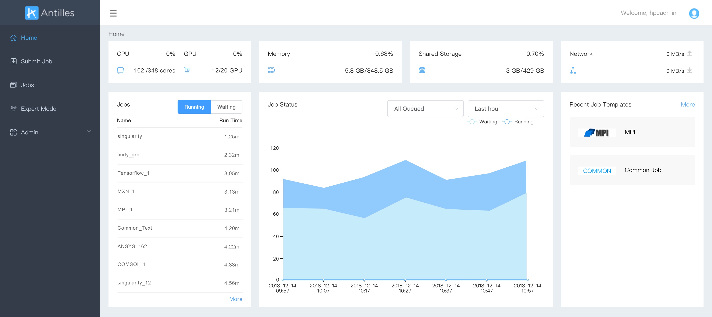


Elements on the cluster overview page
-------------------------------------

- **CPU**: Shows the CPU usage in the cluster, with the number of occupied CPU cores and the total number of CPU cores in the cluster.
- **Memory**: Shows the memory usage in the cluster, with the used memory and the total memory in the cluster.
- **Shared Storage**: Shows the storage usage in the cluster, with the used storage and total storage.
- **Network**: Shows the upload and download rates.
- **Jobs**: Shows the information about jobs that the current user has submitted to the Running or Waiting queue. Switch between **Running** and **Waiting** to view the names of current jobs and their running or waiting time. Click **More** to go to the task details page to view more detailed information about the execution of the jobs.
- **Job Status**: Shows the status of all jobs submitted by the current user. Jobs can be viewed by queue or time period. When sorted by queue, the names of all queues in a cluster are listed. Time period options include **Last hour**, **Last 1 day**, **Last 7 days**, and **Last 30 days**. In the figure, the user can choose historical jobs that are running or waiting, and view the number of jobs in the running status at a specific point in time.
- **Recent Job Templates**: Shows the job templates that were recently used by the user and can be leveraged.

Create a folder
---------------

**Step 1.**

Select **Admin** ➙ **Manage Files** from the left navigation pane.
The Manage Files page is displayed.

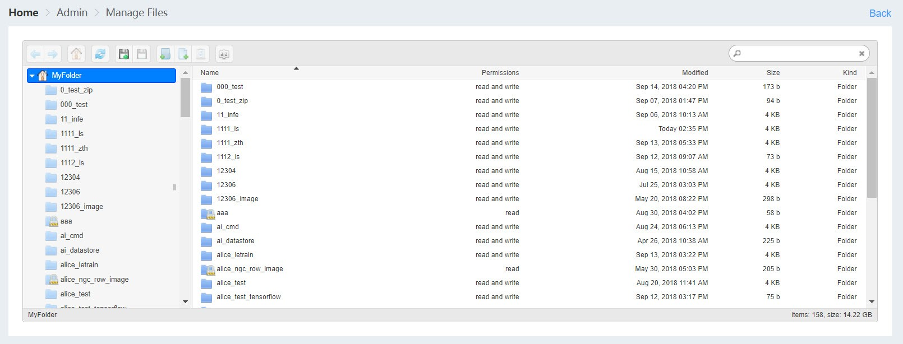

**Step 2.**

Right-click in the blank area of the Manage Files page, and select **New folder** from the shortcut menu.
A new folder is created, with "untitled_folder" as its default name.

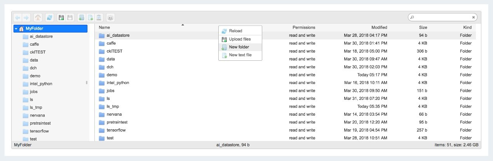

Rename a folder
---------------

**Step 1.**

Select **Admin** ➙ **Manage Files** from the left navigation pane.
The Manage Files page is displayed.


**Step 2.**

Right-click a folder you want to rename, and then select **Rename**.
The name of the selected folder appears in a text box.

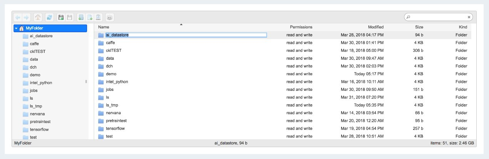

**Step 3.** Type the new folder name in the text box.

The folder is renamed.

Preview an image
----------------

**Step 1.**

Select **Admin** ➙ **Manage files** from the left navigation pane.
The Manage Files page is displayed.


**Step 2.** Right-click an image, and then select **Preview** from the short-cut menu.

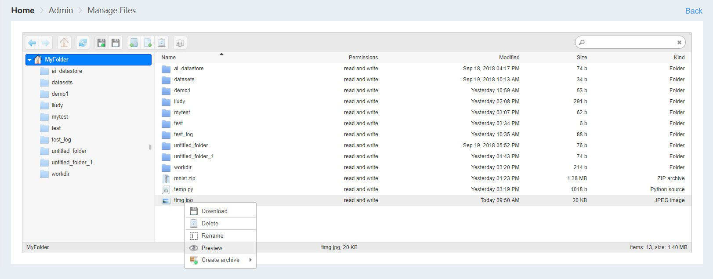

 The image is displayed in preview mode.

Archive files
-------------

**Step 1.**

Select **Admin** ➙ **Manage Files** from the left navigation pane.
The Manage Files page is displayed.


**Step 2.** Right-click a file or folder, place the cursor over **Create archive** from the shortcut menu, and then select the compression format.

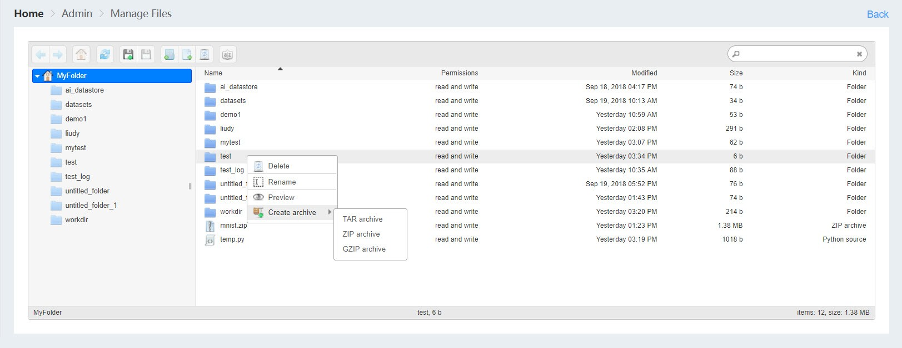

The selected file or folder is archived in your designated format.

Extract an archived file
------------------------

**Step 1.**

Select **Admin** ➙ **Manage files** from the left navigation pane.
The Manage Files page is displayed.


**Step 2.** Right-click an archived file (compressed in TAR, ZIP, or GZIP format) you want to extract, and then select **Extract files from archive** from the shortcut menu.

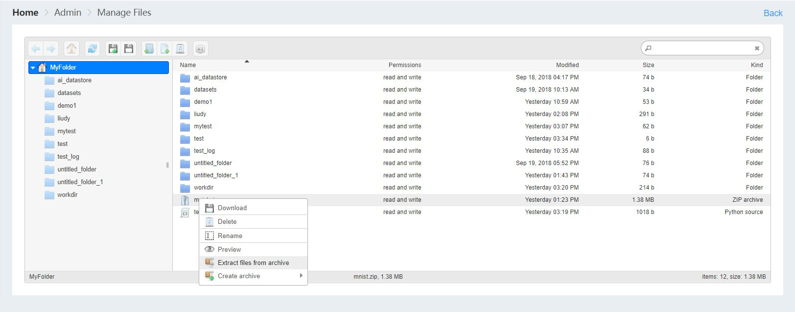

Upload files
------------

**Step 1.**

Select **Admin** ➙ **Manage Files** from the left navigation pane.
The Manage files page is displayed.


**Step 2.** Double-click a folder to open it.

**Step 3.**

Right-click in the blank area, and select **Upload files** from the shortcut menu.
The Upload files dialog is displayed.

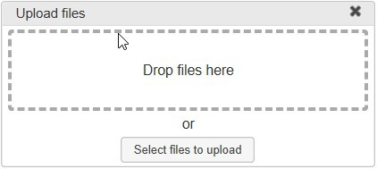

**Step 4.** Select one or more local files to upload using either of the following methods:

- Drag and drop a file or files into the dotted dialog.
- Click **Select files to upload** at the bottom of the Upload files dialog.

Successfully uploaded files are available on the Manage Files page.

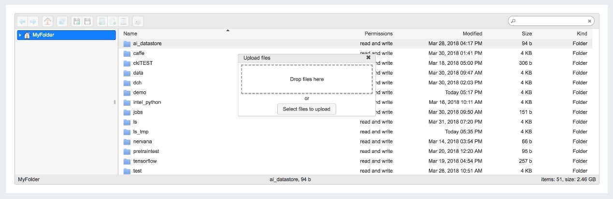


Chapter 4. Job submission
=========================

Submit an HPC job
-----------------

**Step 1.**

Select **Submit Job** from the left navigation pane.
The Submit Job page is displayed.

**Step 2.** Select the **HPC** tab.

Templates for HPC jobs are displayed for your selection. All job submission tasks described in this section are performed on this tab page.

Submit an MPI job
-----------------

An MPI job is a distributed computing job using the MPI standard.

**Step 1.** Click **Use** in the **MPI** area. The **MPI** page is displayed.

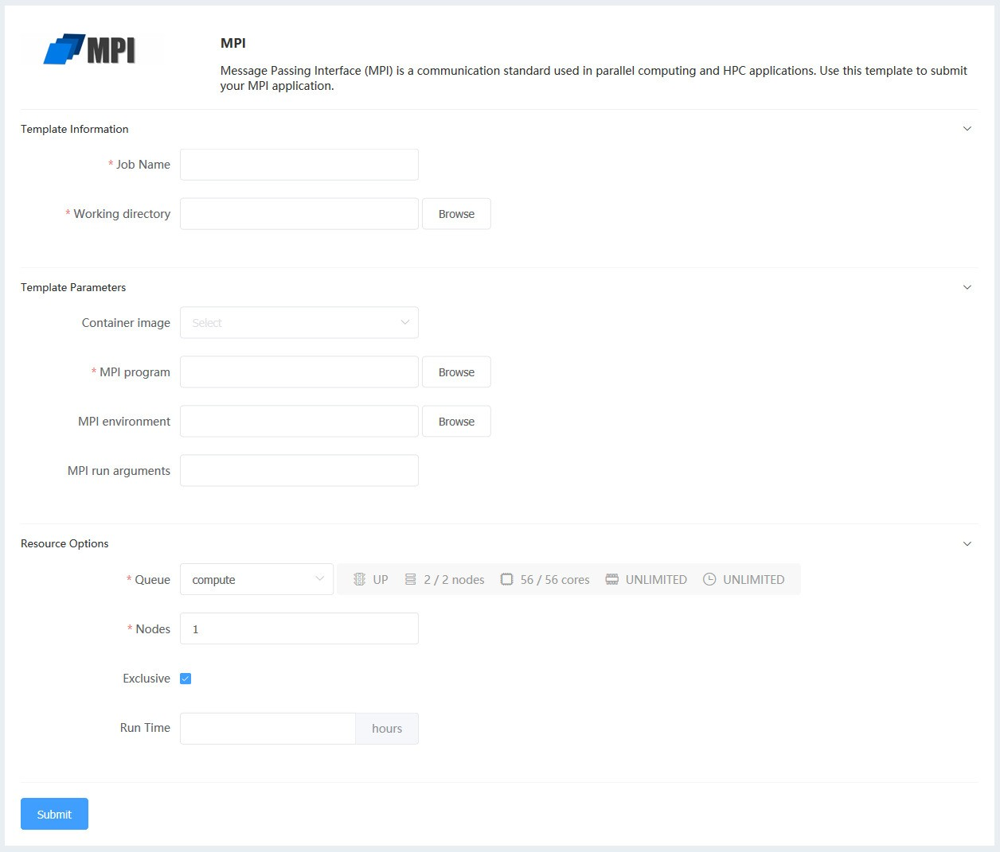

**Step 2.**

Fill in the required information.
Parameters on this page are described as follows:

- **Job directory** (required): the directory for the job
- **MPI program** (required): the MPI program, that is, program that will eventually run the computing task. For the program to carry out parallel computing on multiple servers, it must comply with the MPI standard.
- **MPI environment file** (optional): MPI environment variables
- **MPI parameters** (optional): parameters for running mpirun. Additional parameters should be given in plain text, delineated by spaces.
- **Queue** (required): the name of the queue to which the job belongs. Users can only select queues for which they have access permission.
- **Nodes** (optional): number of computing nodes required to run the program
- **CPU cores per node** (optional): the number of CPU cores required by each computing node to run the program.
- **Memory** (optional): the memory required to run the program
- **Estimated run time** (optional): the time required to run the program
- **Trigger** (optional): the point at which the notification is sent. It is either at the execution or the finish time.
- **Email**: the e-mail to which the notification will be sent.

**Step 3.** Click **Submit**.

The figure below shows an example of how to fill out MPI job information.

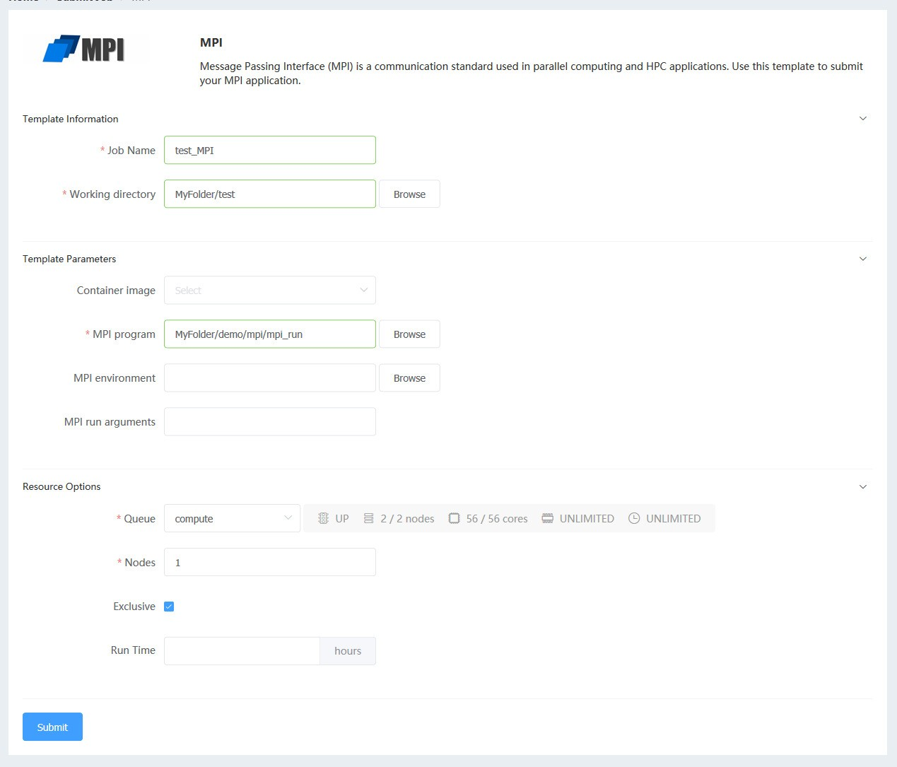

Submit an ANSYS job
-------------------

An ANSYS job is a job using the ANSYS software, where users can run engineering simulations.

**Step 1.**

Click **Use** in the ANSYS area.
The page for ANSYS job submission is displayed.

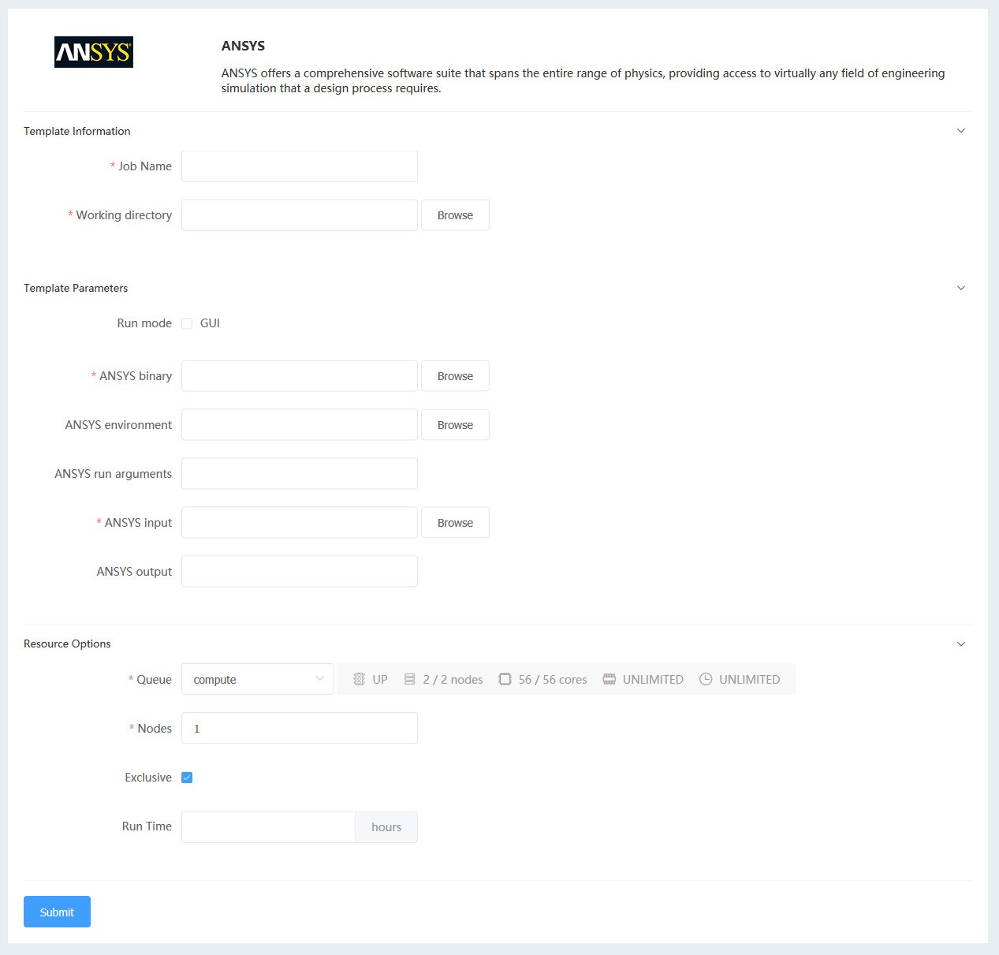

**Step 2.**

Fill in the required information.
Parameters on this page is described as follows:

- **Run mode:** Check **GUI** to run the ANSYS job in GUI mode. Once the job is submitted, a VNC session will be launched and the ANSYS graphical interface will begin to run in the VNC session. It can also be accessed via the VNC management.
- **Working directory** (required): the job directory for the program
- **ANSYS binary** (required): the location of the ANSYS software
- **ANSYS environment** (optional): the environment variables required when running ANSYS
- **ANSYS run arguments** (optional): parameters for running ANSYS. Additional parameters should be given in plain text, delineated by spaces.
- **ANSYS Input** (required): the file imported when running the program
- **ANSYS Output** (required): the file exported when running the program

>   **Note:** For the description of other parameters, see "Submit an MPI job".

**Step 3.** Click **Submit**.

The figure below shows an example of how to fill in the information for an ANSYS job.

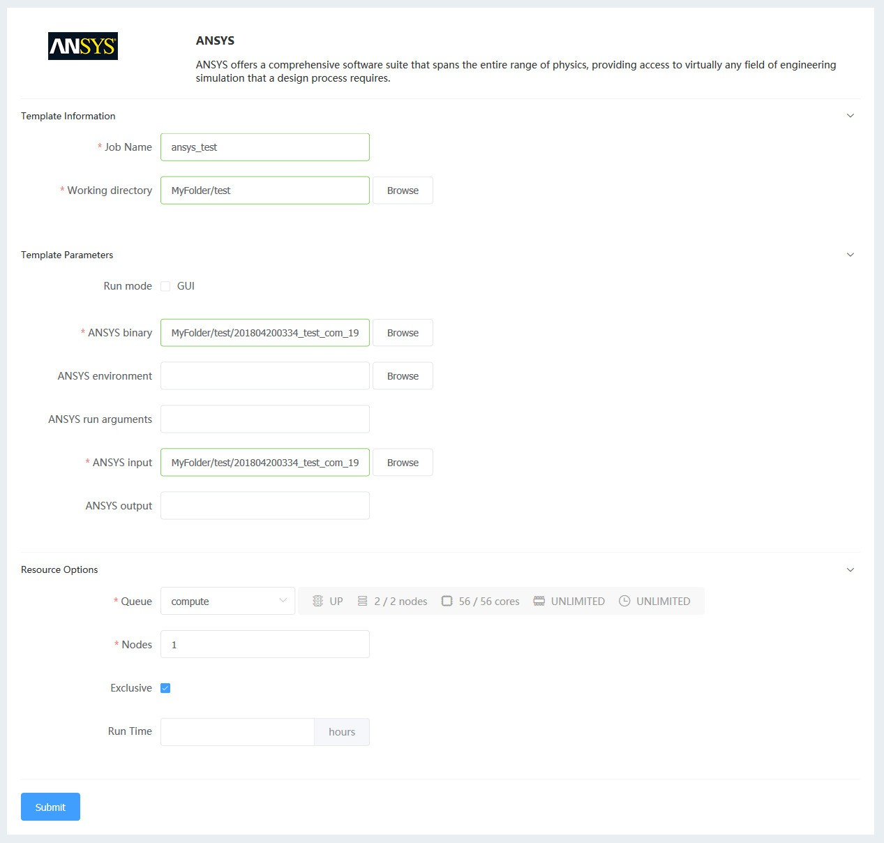


Submit a COMSOL job
-------------------

A COMSOL job is a job using the COMSOL software, where users can model and simulate physics-based problems.

**Step 1.**

Click **Use** in the **COMSOL** area.
The page for COMSOL job submission is displayed.

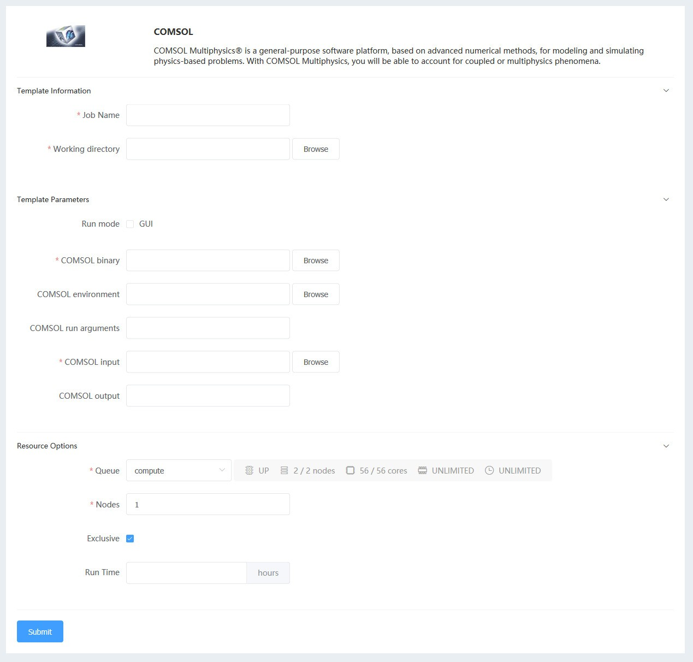

**Step 2.**

Fill in the required information.
Parameters on this page is described as follows:

- **Run mode** : Check **GUI** to run the COMSOL job in GUI mode. Once the job has been submitted, a VNC session will be launched and the COMSOL graphical interface will begin to run in the VNC session. It can also be accessed via the VNC management.
- **Working directory** (required): the job directory for the program
- **COMSOL Binary** (required): the location of the COMSOL software
- **COMSOL environment** (optional): the environment variables required when running COMSOL
- **COMSOL run arguments** (optional): parameters for running COMSOL. Additional parameters should be given in plain text, delineated by spaces.
- **COMSOL input** (required): the file imported when running the program
- **COMSOL output** (required): the file exported when running the program

>   **Note:** For the description of other parameters, see "Submit an MPI job".

**Step 3.** Click **Submit**.

The figure below shows an example of how to fill in the information for a COMSOL job.

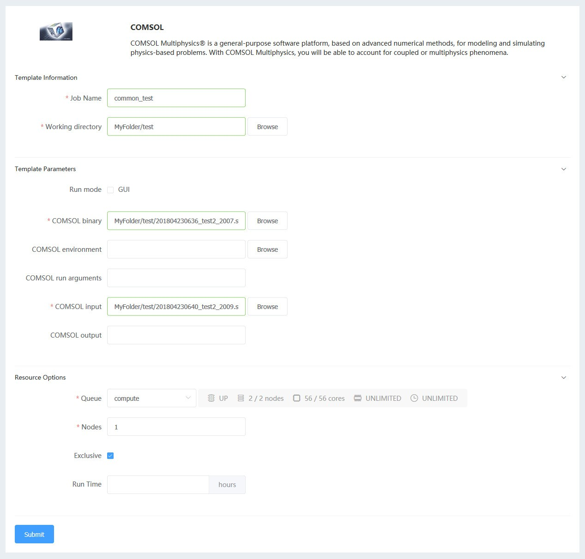


Submit a general job
--------------------

A general job is a computing task where the user fully controls the running mode, resource usage, and job file.

**Step 1.** Select **Submit Job** from the left navigation pane. The Submit Job page is displayed.

**Step 2.** Select the **General** tab.

**Step 3.** Click **Use** in the General Job area. The General Job page is displayed.


**Step 4.** Fill in the job name, and click **Browse** to select a job file.

**Step 5.** Click **Submit**.

The job details are displayed in a dialog.

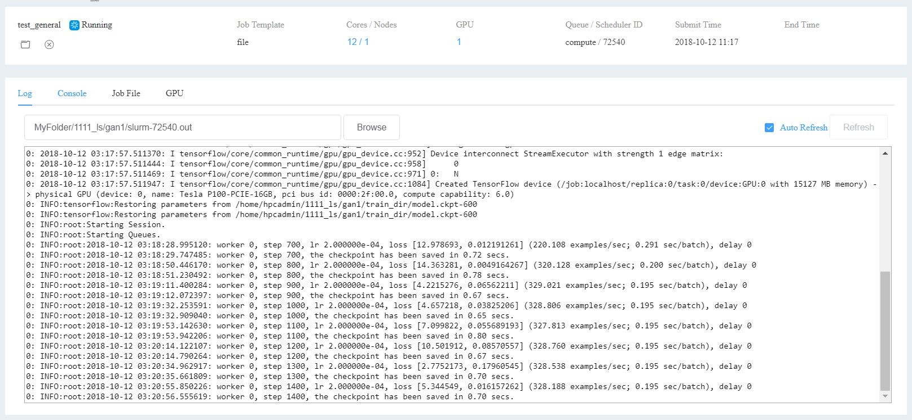

Submit a common job
-------------------

A common job is a script job that the user can quickly write and run from the Web interface.

**Step 1.** Select **Submit Job** from the left navigation pane. The Submit Job page is displayed.

**Step 2.** Select the **General** tab.

**Step 3.** Click **Use** in the Common Job area. The Common Job page is displayed.

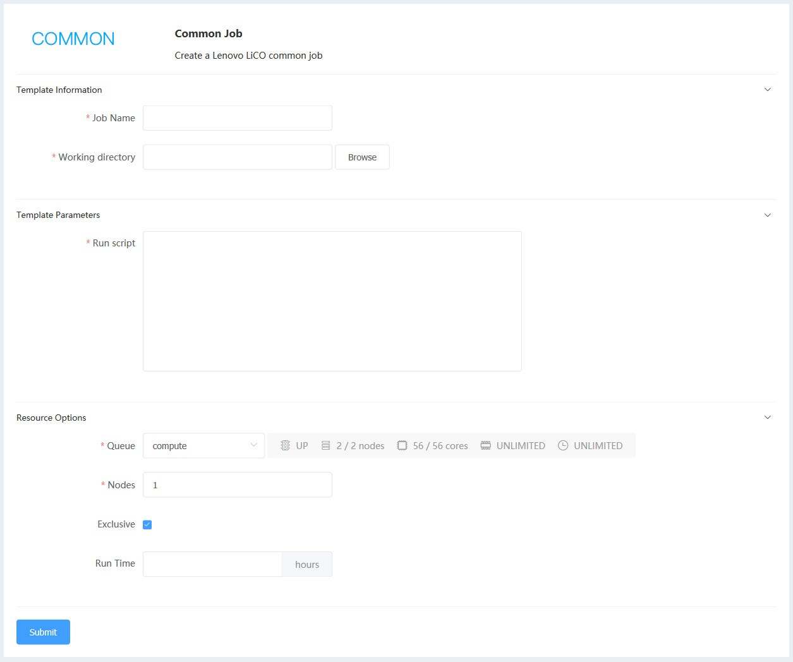

**Step 4.** Fill in the job name.

**Step 5.** Click **Browse** to select a work directory.

**Step 6.** Type the script to be executed in the script editor (Linux Shell commands are supported).

**Step 7.** Select the resources needed to run the script.

**Step 8.** Click **Submit**.

The figure below shows an example of how to fill in the information for a common job.

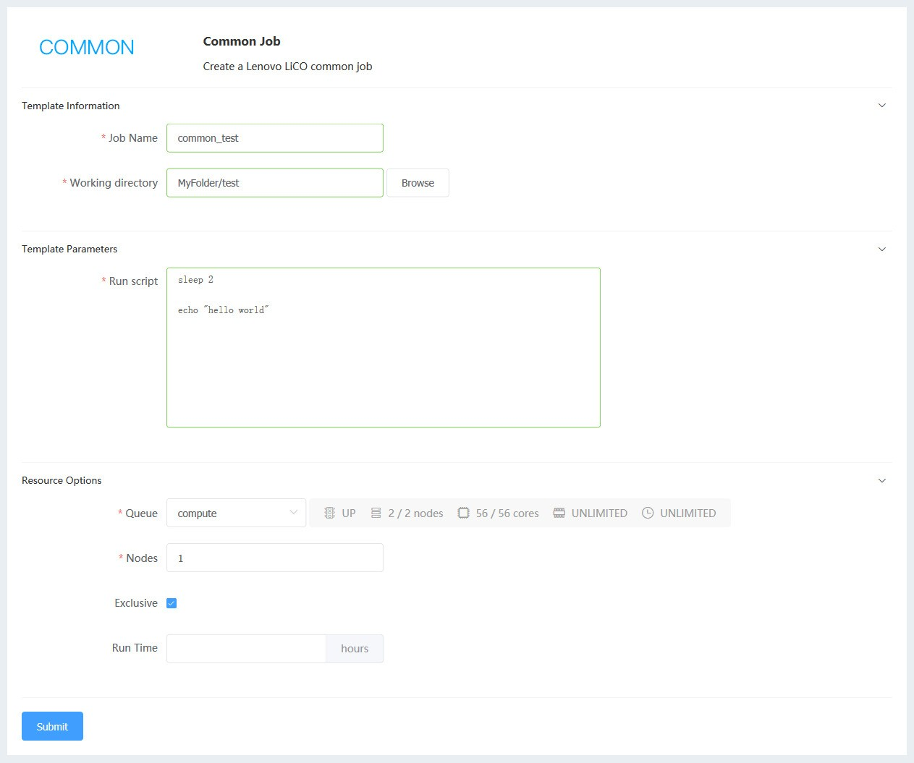


Chapter 5. Manage the job lifecycle
===================================

Cancel a job
------------

**Step 1.**

Select **Jobs** from the left navigation pane.
The Jobs page is displayed.

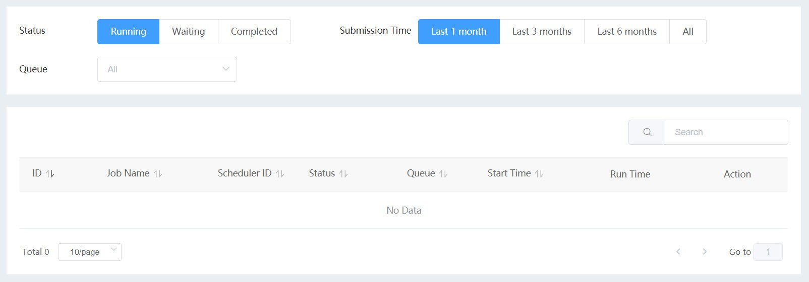

**Step 2.** Click **Running** on the status bar. All running jobs are displayed in a list.

**Step 3.**

Find the job you want to cancel, and select **Action** ➙ **Cancel**
A dialog is displayed, asking you to confirm the action.


**Step 4.** Click **Yes**. 

The job is canceled.

Canceled jobs are available in the Completed list.

Re-run a job
------------

**Step 1.**

Select **Jobs** from the left navigation pane.
The **Jobs** page is displayed.


**Step 2.**

Click **Completed** on the status bar.
All completed jobs are displayed in a list.

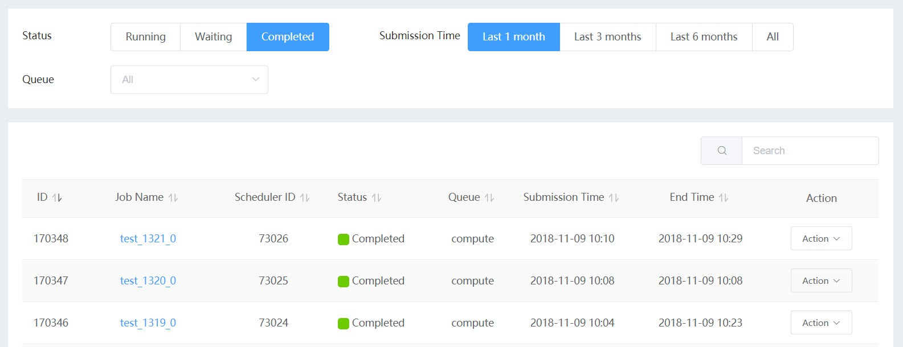

**Step 3.**

Find the job you want to re-run, and select **Action** ➙ **Rerun**.
A dialog is displayed, asking you to confirm the action.


**Step 4.** Click **Yes**.

The job is re-executed.

Delete a job
------------

**Step 1.**

Select **Jobs** from the left navigation bar.
The Jobs page is displayed.


**Step 2.**

Click **Completed** on the status pane.
All completed jobs are displayed in a list.


**Step 3.**

Find the job you want to delete, and select **Action** ➙ **Delete**.
A dialog is displayed, asking you to confirm the action.


**Step 4.** Click **Yes**.

The job is deleted.

GPU job monitoring
------------------

To accelerate the execution of jobs, GPU can be used to increase speed. The system targets jobs using GPU and provides monitoring functions for GPUs on the compute nodes where the jobs are running.

After the user submits the job or uses the job management function to enter the job details page, GPU usage information and GPU monitoring tabs are displayed if this job uses GPU.

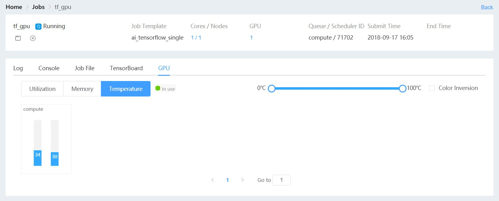

**GPU Use**: The system lists the number of GPUs ordered by the current job. Click the number to show which compute node the job is using, and the number of GPUs used by this node (The actual number used may be smaller than the number ordered).

**GPU Utilization Rate, Memory, and Temperature Monitoring**: Click the **GPU** tab to switch to the real-time GPU monitoring interface. This interface visualizes real-time GPU data for all nodes running this job, and the user can switch to view the GPU usage rate, memory, and temperature. Every frame represents a node, with the name of the node shown in the upper-right corner of the frame. Every column represents a GPU. The blue portion of the column represents specific monitored values. If there is an orange section at the top of the column, the GPU is in use. Using the slider in the upper-right portion of the mobile interface, the user can adjust the colors of the columns to filter and highlight GPUs in the given numerical range. Check the Color Reversal box to the right of the slider to switch the colors that denote values inside and outside the stated range.

VNC management
--------------

With the VNC management feature, user can manage the VNC sessions in a cluster. They can perform VNC management through either of the following methods:

-   Select **Admin** ➙ **VNC** to open the VNC page, and click the corresponding open button for the VNC session to view a session. Provide the account number and password if the session is locked.

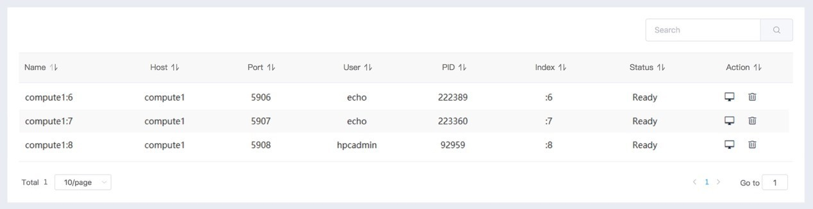

- Log in to a node in a cluster to manage VNC sessions.
- Type vncserver -list to view the VNC sessions that have been created.
- Type vncserver -kill to delete the VNC sessions that have been created.

> **Notes:**
> - The result from the command-line operations above will be reflected in the VNC management page, but there will be a delay of about 30 seconds.
> - If one user has more than 20 VNC sessions on a node, creating additional sessions on this node may result in failure.

Chapter 7. Custom templates
===========================

Antilles allows users to create custom templates. After the user creates a custom template, it can be published by an administrator and then be utilized by other users.

After a template is published, it cannot be edited. In order to edit the template, an administrator needs to unpublish the custom template first.

Create a custom template
------------------------

**Step 1.**

Select **Submit Job** from the left navigation pane.
The Submit Job page is displayed.

**Step 2.**

Click **My Templates** in the upper-right corner of the page.
A page is displayed, showing the custom templates of the current user.

**Step 3.** Click **Create**.

The Create Template page is displayed.

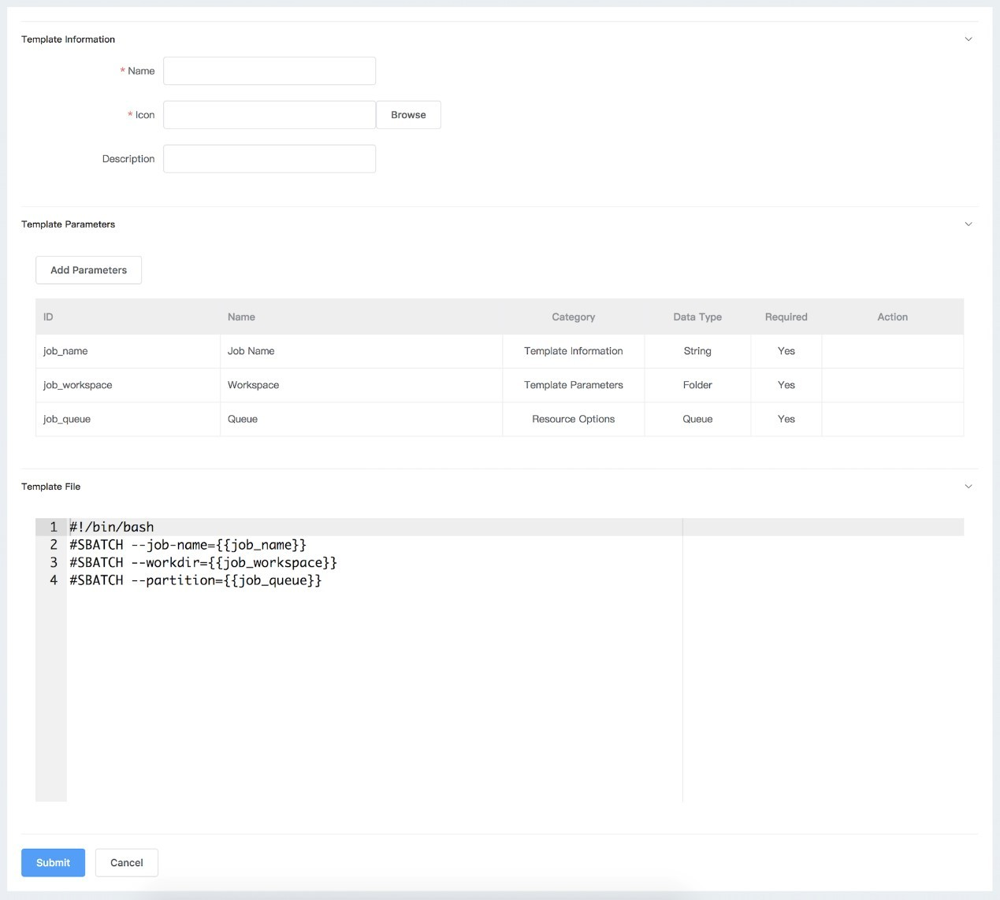

**Step 4.** Fill in the required information.

  1.  In the Template Information area, provide the basic template information.The logo image must be in JPG, PNG, JPEG, or BMP format, with a recommended size of `180*40`.
  2.  In the Template Parameters area, click **Add Parameters**, and then fill in the Add Parameter dialog.

**Step 5.** Click **Submit**.

The newly created custom template is displayed if you click **My Templates**.

Edit a custom template
----------------------

**Step 1.**

Select **Submit Job** from the left navigation pane.
The Submit Job page is displayed.

**Step 2.** Click **My Templates** in the upper-right corner of the page. 

**Step 3.**

Find the template you want to edit, and select **Action** ➙ **Edit**.
The page for editing the template information is displayed.

**Step 4.** Change the template information as required. 

**Step 5.** Click **Submit**.

Copy a custom template
----------------------

**Step 1.**

Select **Submit Job** from the left navigation pane.
The Submit Job page is displayed.

**Step 2.** Click **My Templates** in the upper-right corner of the page.

**Step 3.**

Find the template you want to copy, and select **Action** ➙ **Copy**.
The page for copying the template is displayed.

**Step 4.** Change the template information as required.

**Step 5.** Click **Submit**.

Delete a custom template
------------------------

**Step 1.**

Select **Submit Job** from the left navigation pane.
The Submit Job page is displayed.

**Step 2.** Click **My Templates** in the upper-right corner of the page.

**Step 3.**

Find the template you want to delete, and select **Action** ➙ **Delete**.
The Delete Job Template dialog is displayed.

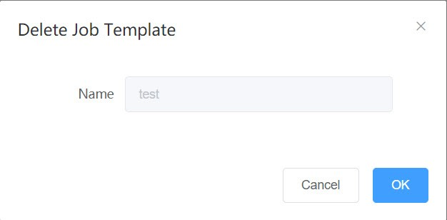

**Step 4.** Click **OK**.

Publish a custom template
-------------------------

Administrator users can publish custom templates on Antilles.

**Step 1.**

Select **Submit Job** from the left navigation pane.
The Submit Job page is displayed.

**Step 2.** Click **My Templates** in the upper-right corner of the page.

**Step 3.**

Find the template you want to publish, and select **Action** ➙ **Publish**.
The Publish job template page is displayed.

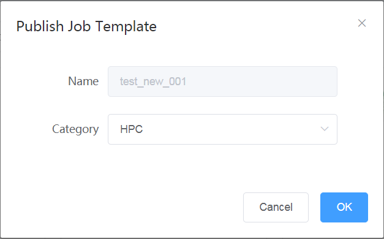

**Step 4.** Fill in the category.

**Step 5.** Click **Submit**.

The selected template is published.

Chapter 8. Expert mode
======================

Antilles provides an expert mode feature that integrates the Web console, file management, and job management functions. This feature allows advanced users to use command lines to submit and manage jobs and to perform operations quickly through the Web interface.

Select **Expert mode** from the left navigation pane to open the Expert modepage.

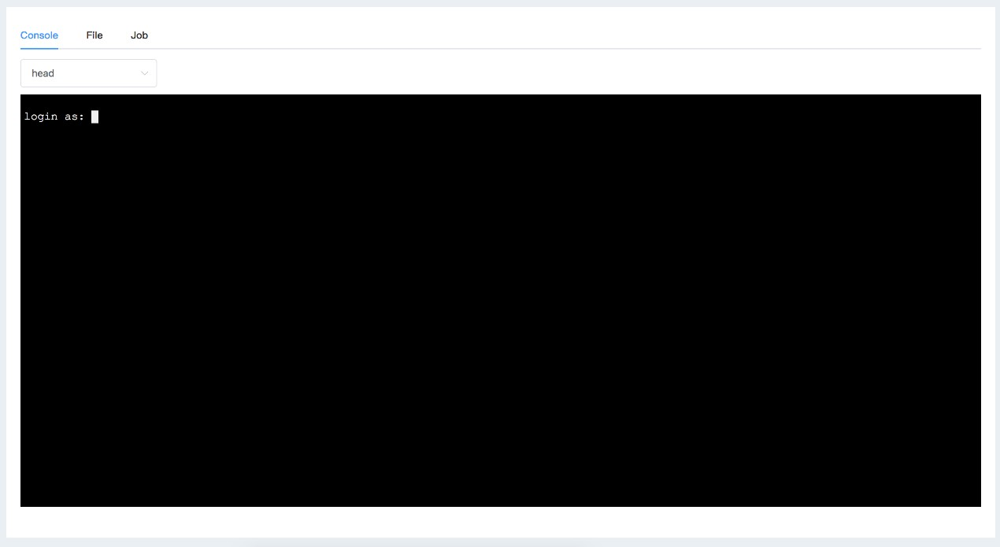

The **Expert mode** page consists of the following tabs:

- **Console**: This tab lists all login nodes in the current cluster. You can select a node to log in.
- **File**: This tab shows the file structure for the currently logged-in user and functions like file management.
- **Job**: This tab shows the jobs in the current cluster and functions like job management.

Submit a job using command lines
--------------------------------

**Step 1.**

Select **Expert mode** from the left navigation pane.
The **Export mode** page is displayed.

**Step 2.** Do either of the following:

  1.  Click the **File** tab, and then upload a compiled job file to **My folder**.
  2.  Click the **Console** tab, and then compile a job using the text editor.

**Step 3.** Log in to a login node through the console, and enter the directory in **My folder** using the absolute path.

**Step 4.** Run the command sbatch `/share/users_root/hpcadmin/jobfile.slurm`.

- You can run the command `sinfo` to view the job status. When the job status changes to `C`, it means the job is completed.
- You can also monitor and manage the job on the **Job** page.

Example of compiled job files
-----------------------------
Below is an example of a Slurm job file:

```
#!/bin/bash
#!/bin/bash
#SBATCH --job-name test
#SBATCH --partition compute
#SBATCH --nodes=2
#SBATCH --tasks-per-node=2
#SBATCH --cpus-per-task=1 cd /share/users_root/user1
python /home/antillesshare/antilles_dl_run.py
```

Elements in the example are described as follows:

- `#SBATCH --job-name test`: the job name
- `#SBATCH --partition compute`: designates the queue batch for the job
- `#SBATCH --nodes=2`: specifies the resources required for the job as two computing nodes
- `#SBATCH --cpus-per-task=1`: specifies the resources required for the job as one CPU core per task
- `python /home/antillesshare/antilles_dl_run.py`: tasks to be executed

Chapter 10. Additional information
==================================

Absolute paths of user directories
----------------------------------

In Antilles, users have full control over the **MyFolder** directory, which can be viewed on the file management page. **MyFolder** is a mapped directory, and the real directory in the operating system is the folder with the user's name in the user root directory corresponding to the parameter **user_rootdir** contained in the configuration file `antilles_1.0.0/etc/conf.yaml`.

For example, if **user_rootdir** sets the path as `/share/users_root`, the absolute path for the root directory of user **hpcadmin** (the **My folder** directory) is `/share/users_root/hpcadmin`. This path is also the home directory for the user in the operating system. When using the web console or the login node in the login system, the directory can be accessed using this absolute path or the path for the home directory.

Failed job submissions
----------------------

In most circumstances failed job submissions in Antilles result from incorrect scheduler service configuration. You can check and resolve problems using the following methods:

- Use an SSH tool to log in to the login node in the system, and re-submit the job with command lines.

  1.  Go to the user directory and locate the job file.
  2.  Run the command sbatch jobfile.slurm to submit the job.
  3.  View the error log.

>   **Note:** The most common problem is exceeding resource limits. For example, if the system has 80 CPU cores, a job requiring 100 cores will lead to a submission failure.

- Log in to the management node, and run scontrol show nodes to check the status of the compute nodes and resources in a cluster. Notify an administrator in the following circumstances:
- The command returns an empty result, indicating that the node has not been added into the scheduler node.
- The command returns a result indicating that some nodes are not working.
- Log in to the management node, and run `sinfo` to check queue settings.

>   **Note:** You need to notify an administrator if an exception is found.

Deletion of VNC sessions
------------------------

If VNC sessions are invisible on the VNC management page, contact an administrator.

If an attempt to delete a VNC session fails, log in to the node associated with the VNC session via SSH, run vncserver-list to check the status of the session, and then use the command vncserver-kill to delete the session.

About 30 seconds after the deletion, refresh the VNC management page.

References for Slurm commands
-----------------------------

For details about Slurm commands, refer to the following Web site: https://slurm.schedmd.com/quickstart.html

Data sources for GPU monitoring
-------------------------------

Antilles can only monitor GPUs produced by NVIDIA. Monitoring data (including GPU usage, memory, temperature, and usage status) is obtained through the official NVIDIA API.

To check GPU monitoring data on the node's operating system, run the `nvidia-smi` command.
